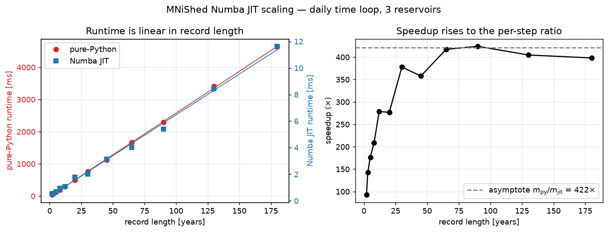

Benchmarks
==========

MNiShed's daily time loop is the inner loop of every simulation, and during
calibration it runs thousands of times. v3.0.0 added a `Numba
<https://numba.pydata.org>`_ just-in-time (JIT) compiled implementation of
that loop, enabled with the ``jit`` extra (see :doc:`installation`).

When the JIT is used
~~~~~~~~~~~~~~~~~~~~~

The compiled loop covers the full daily model — including PDM saturation-excess
(``pdm_H0``) and ``et_water_stress`` — so the JIT runs whenever Numba is
importable. The pure-Python loop runs instead only when Numba is unavailable:

* Numba is not installed (the default without the ``jit`` extra).
* Numba is installed but fails to import — most often a NumPy/Numba version
  mismatch (the ``jit`` extra pins ``numpy<2.3`` to avoid this).

In the second case MNiShed emits a one-time ``UserWarning`` from the first
:meth:`~mnished.Buckets.run`, so a silent ~100× slowdown is not a surprise.
(A plain "Numba not installed" stays quiet, since pure Python is the expected
default without the extra.) The pure-Python and JIT loops are verified to
produce identical results, so the only difference is speed.

The figure on this page was produced by running ``benchmarks/bench_jit.py``
and ``benchmarks/plot_jit.py`` from the repository root. To regenerate it
from a fresh benchmark run, in an environment with Numba::

    pip install '.[jit]'
    python benchmarks/bench_jit.py
    python benchmarks/plot_jit.py

``bench_jit.py`` saves a timestamped, commit-stamped results file under
``benchmarks/results/``; ``plot_jit.py`` reads the most recent one.

Hardware context for the results shown here:

* **CPU**: AMD Ryzen 7 7840U (16 logical cores)
* **RAM**: 46.4 GiB
* **OS**: Linux 6.17, Ubuntu 24.04
* **Python** 3.12.7 · **NumPy** 2.2.6 · **Numba** 0.65.1

Absolute timings will differ on other hardware; the relative speedup is
broadly representative.

JIT scaling
-----------

   Left: per-run time of the daily loop versus record length, for the Numba
   JIT and the same code forced to pure Python (note the two y-axes — they
   differ by ~300×). Right: the resulting speedup versus record length.

The benchmark times a single forward ``run()`` over a sweep of record
lengths — a synthetic three-reservoir watershed with daily forcing, varying
only the number of time steps — comparing the Numba JIT against the *same
code* forced to pure Python (via ``mnished.mnished._numba_available``).

**Both runtimes are linear in the record length** :math:`N` (number of daily
time steps), as the left panel shows: a fixed overhead plus a per-step cost.

* pure-Python: :math:`\approx 71\ \mu\text{s}` per simulated day
  (:math:`R^2 = 0.9998`)
* Numba JIT: :math:`\approx 0.17\ \mu\text{s}` per simulated day
  (:math:`R^2 = 0.997`)

Because the speedup is the **ratio of two straight lines**, it is not a single
number. At short records the fixed overheads dominate (~90–140× for a
2–3-year run), and as the record lengthens the speedup rises toward the
asymptotic per-step ratio :math:`m_{\mathrm{py}}/m_{\mathrm{jit}} \approx
400\times` (right panel). For the multi-decade to century-long daily records
typical of water-balance and calibration studies, the JIT is **roughly
300–400× faster** than the pure-Python loop.

The JIT carries a **one-time compilation cost** of a few seconds on the first
run; Numba caches the compiled function (``cache=True``), so subsequent runs
and processes reuse it with no further compile cost.

**When the JIT is used.** The JIT path runs automatically when Numba is
installed, for the common configuration. It falls back to the pure-Python
loop — with identical results — for the two configurations it does not yet
cover: the probability-distributed (PDM) saturation-excess model and the
storage-dependent ``et_water_stress`` ET module. JIT↔pure-Python equivalence
is verified by the test suite.
