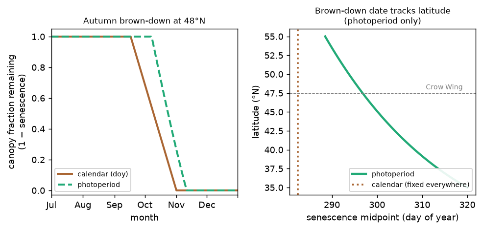

Configuration Reference
========================

MNiShed is configured entirely through a YAML file. This page documents all 
available options.

Configuration File Structure
~~~~~~~~~~~~~~~~~~~~~~~~~~~~~

.. code-block:: yaml

    timeseries:
        # Data input section
    
    initial_conditions:
        # Starting state of reservoirs and snowpack
    
    catchment:
        # Basin properties
    
    general:
        # Simulation settings
    
    reservoirs:
        # Reservoir cascade for the whole basin (a single hydraulic zone).
        # Replace with `sub_catchments:` to model parallel zones.

    snowmelt:
        # Required section; snowpack processes are only active if
        # Mean Temperature [C] is present in the input CSV

The ``timeseries`` section
~~~~~~~~~~~~~~~~~~~~~~~~~~~

.. list-table::
   :widths: 25 15 50
   :header-rows: 1

   * - Option
     - Type
     - Description
   * - ``datafile``
     - string
     - Path to CSV input file with daily time series

Example:

.. code-block:: yaml

    timeseries:
        datafile: data/streamflow_2010_2020.csv

The ``initial_conditions`` section
~~~~~~~~~~~~~~~~~~~~~~~~~~~~~~~~~~

.. list-table::
   :widths: 35 15 40
   :header-rows: 1

   * - Option
     - Type
     - Description
   * - ``water_reservoir_effective_depths__mm``
     - list of floats
     - Initial water depth (mm) in each reservoir, listed top to bottom
   * - ``snowpack__mm_SWE``
     - float
     - Initial snowpack depth in mm snow-water equivalent (SWE)

Example:

.. code-block:: yaml

    initial_conditions:
        water_reservoir_effective_depths__mm:
            - 150    # Top (soil) reservoir starts at 150 mm
            - 400    # Bottom (groundwater) starts at 400 mm
        snowpack__mm_SWE: 50  # 50 mm SWE initially

This top-level block applies to a single-zone basin. When the basin is split
into parallel zones, each sub-catchment carries its own ``initial_conditions``
block instead (see :ref:`sub-catchments-config`).

The ``catchment`` section
~~~~~~~~~~~~~~~~~~~~~~~~~

.. list-table::
   :widths: 35 15 40
   :header-rows: 1

   * - Option
     - Type
     - Description
   * - ``drainage_basin_area__km2``
     - float
     - Basin area (km²); used for discharge-to-depth conversion
   * - ``evapotranspiration_method``
     - string
     - ``datafile`` or ``ThornthwaiteChang2019``. See note below.
   * - ``water_year_start_month``
     - int
     - Month (1–12) when water year begins (10 = October for USGS)
   * - ``baseflow_Q``
     - float
     - Constant regional groundwater import (mm/day). Added to modeled
       discharge after routing; not mass-balanced against P or ET.
       Default ``0.0`` (disabled). Use only when independent
       hydrogeological evidence supports an external groundwater source.

.. note::

    ``ThornthwaiteChang2019`` requires long-term monthly temperature
    normals to compute the Thornthwaite heat index :math:`I` and
    exponent :math:`a`. If normals are not supplied via
    ``T_monthly_normals`` in the :class:`~mnished.Buckets`
    constructor, they are computed automatically from the mean monthly
    temperatures in the input record. A ``UserWarning`` is raised when
    the record is shorter than 20 years, as a short period may not
    represent long-term climatology. For best results, supply normals
    from a 30-year reference period (e.g. WMO 1991–2020 normals).

    Water years with no discharge observations receive an ET multiplier
    of 1.0 (raw ET, no water-balance correction) with a ``UserWarning``
    naming the affected years.

.. warning::

    **Temperature-index ET and vegetation phenology.** Because
    ``ThornthwaiteChang2019`` derives ET from temperature alone, it cannot
    represent seasonality when the actual ET cycle is *out of phase with
    temperature*. The clearest case is cold-region forests, where canopy
    leaf-out lags spring warming by weeks: Thornthwaite ramps ET up with the
    spring temperature rise, but little transpiration occurs before leaf-out,
    so early-spring ET is over-estimated. In snowmelt basins this can
    *consume the spring freshet* — evaporating meltwater that should appear
    as streamflow — and, because calibration then lowers ``et_scale`` to
    recover the annual water balance, it inflates flow in the remaining
    seasons. Where phenology and temperature are out of phase, prefer
    measured ET (``evapotranspiration_method: datafile``), ideally from a
    remote-sensing / NDVI-based product that follows the actual green-up.

Example:

.. code-block:: yaml

    catchment:
        drainage_basin_area__km2: 3800
        evapotranspiration_method: datafile
        water_year_start_month: 10
        baseflow_Q: 0.0   # disabled; set > 0 for regional groundwater import

.. _vegetation-phenology:

Vegetation phenology (optional)
~~~~~~~~~~~~~~~~~~~~~~~~~~~~~~~~~

An optional ``phenology`` block applies a growing-degree-day (GDD) vegetation
coefficient (:math:`K_c`) to the ``ThornthwaiteChang2019`` ET demand, correcting
the temperature–phenology phasing described in the warning above. It suppresses
early-spring ET until accumulated warmth predicts leaf-out, then lets the
water-balance / ``et_scale`` correction re-close the annual total — reshaping the
seasonal ET cycle without changing the annual amount. It is **off by default**,
and is ignored for ``evapotranspiration_method: datafile`` (measured ET already
reflects the canopy).

.. code-block:: yaml

    phenology:
        enabled: true
        leafout_GDD:          100.0  # green-up threshold — the one knob to tune / calibrate
        # --- the rest are fixed from priors; defaults suit temperate deciduous ---
        base_temperature__C:  5.0    # GDD base temperature
        full_canopy_GDD:      400.0  # cumulative GDD at full canopy
        dormant_Kc:           0.5    # ET coefficient outside the growing season
        full_Kc:              1.0    # ET coefficient at full canopy
        # --- autumn senescence: a fixed calendar window ('doy', the default) ---
        senescence_method:    doy
        senescence_start_doy: 260    # day-of-year senescence begins (~mid-Sep)
        senescence_end_doy:   305    # day-of-year fully dormant (~early Nov)
        # --- or drive it by day length ('photoperiod'); latitude-transferable ---
        # senescence_method:                photoperiod
        # senescence_photoperiod__hr:       11.0   # critical day length [hr]
        # senescence_photoperiod_span__hr:  1.8    # decline span [hr]

:math:`K_c` holds at ``dormant_Kc`` through winter and early spring, ramps up as
accumulated GDD (base ``base_temperature__C``, reset each calendar year) rise from
``leafout_GDD`` to ``full_canopy_GDD``, holds at ``full_Kc`` through summer, then
declines back to ``dormant_Kc`` over the day-of-year senescence window. The
defaults give a mid-to-late-May leaf-out appropriate to north-central Minnesota.

**One free parameter.** Only ``leafout_GDD`` (green-up timing) carries information
the streamflow can constrain, so it is the only knob exposed as a calibration
parameter — ``run_and_score(leafout_GDD=...)``, or ``target: leafout_GDD`` in a
``params.yml``. The rest are deliberately fixed from priors: ``full_Kc`` and the
overall :math:`K_c` magnitude are degenerate with ``et_scale`` (the water balance
fixes the annual total, so only the :math:`K_c` *shape* matters);
``base_temperature__C`` is collinear with the GDD threshold; and the senescence
window is a stable seasonal prior. Set them deliberately, but do not calibrate
them all at once — that would be a parameter-degeneracy machine. Where possible,
fix ``leafout_GDD`` itself from regional phenology (e.g. a spring-index product)
so phenology adds no free parameter at all.

**Senescence is an active fall lever.** Autumn brown-down sets how fast the canopy
ET draw falls off, controlling the autumn ET draw and therefore autumn discharge —
on the Crow Wing River this was the difference between a fall over-prediction and a
closed fall balance. Two forms are available, via ``senescence_method``:

* ``doy`` (default) — a fixed calendar window, from ``senescence_start_doy`` to
  ``senescence_end_doy``. Simple and backward-compatible, but the brown-down date
  is tied to the calendar and does not transfer across latitude.
* ``photoperiod`` — day-length-driven brown-down. Senescence begins as the
  photoperiod falls below ``senescence_photoperiod__hr`` and completes over a
  further ``senescence_photoperiod_span__hr`` of day-length decline, restricted to
  the post-solstice half-year so the equally short days of spring do not trigger
  it. Because the *date* a given photoperiod is reached shifts with latitude, the
  same two day-length numbers place autumn brown-down correctly at any latitude —
  the fixed-DOY window cannot. It reads the ``Photoperiod [hr]`` forcing column
  (the same day-length input ``ThornthwaiteChang2019`` uses), so it needs no extra
  data.

  The critical day length defaults to **11.0 hr**, deliberately *below* the
  ~12-hr autumn-equinox value. This is what makes the cue transfer in the
  physically correct direction — higher latitudes senesce *earlier* — because a
  sub-equinox day length is reached sooner where the day shortens faster after
  the equinox; a near- or above-equinox threshold transfers weakly or even
  backwards. With the default span (1.8 hr) the brown-down completes in
  mid-November at mid-northern latitudes, and its midpoint moves about 1.6 days
  earlier per degree of latitude. Note this default browns down ~2–3 weeks later
  than the ``doy`` 260/305 calendar window at ~47°N, so a basin previously tuned
  to the calendar window should be re-checked when switching.

Treat the defaults as a temperate-deciduous starting point and adjust per basin.
Pure photoperiod captures *part* of the autumn phenological gradient — temperature
also drives senescence, which is the role of a remote-sensing / NDVI factor
(MNiMORPH/MNiShed#26) — but unlike a fixed calendar date it transfers across
latitude with no per-basin re-dating.

   Calendar (``doy``) versus photoperiod-driven autumn senescence. *Left:* the
   two brown-down forms at the Crow Wing latitude (~47.5°N); the photoperiod form,
   anchored to a sub-equinox critical day length, browns down somewhat later than
   the 260/305 calendar window. *Right:* the brown-down midpoint date versus
   latitude. A fixed calendar window is the same date at every latitude (vertical
   line); the photoperiod cue moves ~1.6 days earlier per degree northward —
   modest, but in the physically correct direction and free of any per-basin
   re-dating. Generated by ``docs/figures/plot_phenology_senescence.py``.

**Setting the leaf-out prior from a regional date.** The one informative knob,
``leafout_GDD``, is latitude-dependent: a more-northern basin leafs out later and
so reaches a larger cumulative GDD at green-up (Crow Wing calibrates near 200 GDD
against a late-May leaf-out, versus the ~100-GDD default tuned to a basin further
south). Rather than guess it or fit a fragile latitude→GDD curve,
:func:`~mnished.leafout_GDD_from_date` converts a *regional leaf-out date* into the
prior by accumulating the basin's own forcing GDD to that date:

.. code-block:: python

    import pandas as pd
    from mnished import leafout_GDD_from_date

    df = pd.read_csv("crow_wing_forcing.csv", parse_dates=["Date"])
    # north-central MN canopy leaf-out ~ May 20 (USA-NPN Extended Spring Index)
    leafout_GDD = leafout_GDD_from_date(df, 5, 20)   # ~ 185 GDD

The leaf-out date is what spring-index phenology climatologies actually provide
(the USA National Phenology Network Extended Spring Indices; Schwartz, Ault &
Betancourt 2013, see :doc:`references`), and it carries the latitude dependence
implicitly — the same date integrates to a larger GDD against a colder northern
forcing. Use the resulting number as the fixed ``leafout_GDD`` (no free parameter),
or as the centre of its calibration bounds.

**Closure choice.** Because GDD enters nonlinearly, the factor corrects seasonal
*phasing* rather than being absorbed by ``et_scale``, and the water-balance
correction normalises against the phenology-adjusted demand, so the annual total
is preserved across closure modes. (The land-ET closure is exact only over a
common finite-data day-set; with ragged missing forcing/discharge, or a lake basin
whose open-water evaporation sits outside the land closure, it is approximate.) In
practice ``enforce_water_balance: 'none'`` with
a free ``et_scale`` gives the best phenology fit — ``et_scale`` is then free to set
the annual level while ``leafout_GDD`` sets the phase, whereas a per-year or global
multiplier can over-produce other seasons when it cannot tune the annual level.
The closure also trades against melt-factor peakiness: a sharper melt factor gives
stronger freshet peaks but a harder-to-balance annual total.

.. seealso::

   The :doc:`example_crow_wing` worked example calibrates ``leafout_GDD`` on a
   real northern-forest basin (settling at a latitude-appropriate late-May
   green-up) and shows how the phenology coefficient fixes an evaporated snowmelt
   freshet.

The ``general`` section
~~~~~~~~~~~~~~~~~~~~~~~

.. list-table::
   :widths: 25 15 50
   :header-rows: 1

   * - Option
     - Type
     - Description
   * - ``spin_up_cycles``
     - int or ``null``
     - Number of complete passes through data before the main run. Use 0 to
       skip spin-up (e.g. when supplying ``initial_states`` for chained
       decade runs). ``null`` (or omitting the key when calling
       :func:`~mnished.calibration.run_and_score`) triggers automatic
       calculation: ``ceil(τ_max / record_length)``, where ``τ_max`` is the
       longest reservoir e-folding time. Because initial conditions are set
       to analytical steady-state depths, one e-folding time is sufficient
       to resolve seasonal and inter-annual climate memory.
   * - ``et_alpha``
     - float
     - Fraction (0–1) of potential ET drawn from the top (soil) reservoir
       when ``et_reservoir_draw: true``. The remainder ``1 − et_alpha`` is
       drawn from the second reservoir. Default ``1.0`` (all ET from top
       reservoir). Has no effect when ``et_reservoir_draw: false``. See
       :ref:`et-modules`.
   * - ``direct_runoff_fraction``
     - float
     - Fast-bypass fraction (0–1) of positive daily recharge that exits
       directly as runoff, bypassing the reservoir cascade. Active only
       when ``direct_runoff: true`` in the ``modules`` block. Default
       ``0.0`` (disabled). Also settable as a calibration parameter via
       :func:`~mnished.calibration.run_and_score`.
   * - ``enforce_water_balance``
     - string
     - Controls how ET is scaled to close the water balance.
       Default ``'water-year'`` if the key is absent. Accepted values:

       ``'water-year'`` — scale ET by a per-water-year multiplier so that
       P − Q − ET = 0 over each water year.

       ``'global'`` — scale ET by a single multiplier computed from the full
       record (sum(P − Q) / sum(ET_raw)). No per-year overfitting; does not
       add hidden degrees of freedom to AIC comparisons. Recommended when
       calibrating with a long record and comparing models by AIC.

       ``'none'`` — use raw ET without any correction. Appropriate only when
       supplying trusted measured ET (e.g. eddy covariance). Using ``'none'``
       with ``ThornthwaiteChang2019`` raises a warning because Thornthwaite ET
       carries large systematic biases. Also appropriate when ``et_scale`` is
       a free calibration parameter (see :ref:`et-modules`).

       Legacy boolean values are accepted: ``true`` maps to ``'water-year'``
       and ``false`` maps to ``'none'``.

Example:

.. code-block:: yaml

    general:
        spin_up_cycles: 2                  # Run through data twice to initialize
        enforce_water_balance: water-year  # default; omit to accept the default
        et_alpha: 1.0                      # fraction of ET from top reservoir (et_reservoir_draw only)
        direct_runoff_fraction: 0.0        # fast-bypass fraction (direct_runoff module only)

The ``reservoirs`` section
~~~~~~~~~~~~~~~~~~~~~~~~~~

This section defines the cascade of reservoirs (1 or more) for a basin treated
as a single hydraulic zone; each may be linear or nonlinear (power-law, via
``recession_exponents``). All lists must have the same length. To split the
basin into parallel zones, use :ref:`sub-catchments-config` instead.

.. list-table::
   :widths: 35 15 40
   :header-rows: 1

   * - Option
     - Type
     - Description
   * - ``recession_coefficients``
     - list of floats
     - Recession coefficient per reservoir. For a **linear** reservoir
       (``recession_exponents`` entry = 1) this is the e-folding drainage
       timescale in days; for a **nonlinear** reservoir (exponent > 1) it is a
       drainage coefficient (units day·mm^(b−1)), **not** a timescale — use
       :meth:`~mnished.Reservoir.mean_residence_time` for a comparable
       timescale (see :ref:`mean residence time <mean-residence-time>`).
   * - ``exfiltration_fractions``
     - list of floats
     - Fraction (0–1) of drainage exiting as discharge. Used by the
       ``fraction`` and ``threshold`` junction types; ignored for
       ``leakance``.
   * - ``junction_types``
     - list of strings
     - Routing rule at each reservoir's outlet to the next-deeper reservoir:
       ``fraction`` (default), ``leakance``, or ``threshold``. See
       :ref:`reservoir-junctions`. Default: all ``fraction`` (the
       ``exfiltration_fractions`` split).
   * - ``leakance_R__days``
     - list of floats or ``null``
     - Leakance resistance :math:`R` (days) for reservoirs whose
       ``junction_types`` entry is ``leakance``. Downward flow is
       :math:`\max(H_i - H_{i+1}, 0)/R`, capped at the total drainage;
       larger :math:`R` impedes it. Required for a ``leakance`` junction;
       ignored otherwise. Default: all ``null``.
   * - ``H_threshold__mm``
     - list of floats
     - Dead-storage depth (mm) for reservoirs whose ``junction_types`` entry
       is ``threshold``: only :math:`\max(H - H_\text{thr}, 0)` drains, so
       storage below the threshold is retained indefinitely. Default: all
       ``0.0`` (no threshold; full storage drains).
   * - ``maximum_effective_depths__mm``
     - list of floats
     - Storage capacity (mm) per reservoir; use ``.inf`` for unlimited
   * - ``pdm_H0__mm``
     - list of floats or ``null``
     - PDM characteristic depth (mm) per reservoir. When set for a
       reservoir, a fraction :math:`f_\text{sat} = 1 - e^{-H / H_0}` of
       incoming recharge becomes saturation-excess runoff. ``null`` (or
       omitting the entry) disables PDM for that reservoir. Default: all
       ``null`` (PDM off). Mutually exclusive with a finite
       ``maximum_effective_depths__mm`` entry for the same reservoir.
   * - ``tile_fractions``
     - list of floats
     - Fraction (0–1) of infiltrating water diverted to a fast tile-drain
       sub-reservoir, per main reservoir. Default: all ``0.0`` (no tile
       drainage). When non-zero, the corresponding
       ``tile_residence_times__days`` entry must also be set.
   * - ``tile_residence_times__days``
     - list of floats or ``null``
     - E-folding residence time (days) of the tile-drain sub-reservoir per
       main reservoir. Required when the corresponding ``tile_fractions``
       entry is greater than zero; ignored otherwise. Default: all ``null``.
   * - ``multipath_thresholds__mm``
     - list of floats or ``null``
     - Storage depth (mm) above which a *parallel* fast drainage path
       activates for each reservoir. ``null`` disables multipath for that
       reservoir. When set, adds
       :math:`Q_\text{mp} = \max(0, H - H_\text{thr})/\tau_\text{mp}` to
       discharge alongside the primary recession. Requires the matching
       ``multipath_timescales__days`` entry. Distinct from the
       ``tile_fractions``/``tile_residence_times__days`` mechanism (see
       below). Default: all ``null`` (multipath off).
   * - ``multipath_timescales__days``
     - list of floats or ``null``
     - E-folding timescale (days) of the parallel multipath drain.
       Required when the corresponding ``multipath_thresholds__mm`` entry
       is set; ignored otherwise. Default: all ``null``.
   * - ``recession_exponents``
     - list of floats
     - Power-law recession exponent :math:`b` per reservoir. :math:`b = 1`
       recovers the standard linear reservoir; :math:`b > 1` produces
       concave recession limbs consistent with subsurface flow theory
       (Brutsaert & Nieber 1977; Kirchner 2009). The theoretical value
       for catchment-integrated baseflow recession is :math:`b \approx 2.2`
       (Brutsaert & Nieber 1977); calibrated soil-zone values are typically
       larger (:math:`b \approx 3`–5). Default: all ``1.0`` (linear).
       Also overridable per calibration run via
       :func:`~mnished.calibration.run_and_score`. See
       :doc:`model_description` for theory and :doc:`recession_analysis`
       for estimating *b* from observed streamflow.

Example:

.. code-block:: yaml

    reservoirs:
        recession_coefficients:
            - 16      # Interflow: fast lateral drainage, days to weeks
            - 200     # Soil zone: seasonal storage, months
            - 3650    # Groundwater: multi-year storage
        exfiltration_fractions:
            - 0.8     # 80% to stream, 20% percolates to soil zone
            - 0.1     # 10% to stream, 90% recharges groundwater
            - 1.0     # All exits as baseflow
        maximum_effective_depths__mm:
            - .inf
            - .inf
            - .inf

No reservoir is fixed to a particular process; physical meaning is set
by the parameters. Successive reservoirs naturally span progressively
longer storage timescales — from interflow (days) to soil moisture
(months) to groundwater (years) — but that mapping is the user's choice.

A single ``reservoirs`` block describes one cascade for the whole basin. To
split the basin into parallel hydraulic zones, use the ``sub_catchments``
section below instead.

.. _sub-catchments-config:

The ``sub_catchments`` section
~~~~~~~~~~~~~~~~~~~~~~~~~~~~~~~

Use ``sub_catchments`` in place of the top-level ``reservoirs`` block to
represent a basin as several **parallel sub-catchments** — spatially distinct
hydraulic zones (for example till uplands versus lake-clay lowlands) that drain
to the same channel in parallel rather than through one vertical cascade. Each
entry is one zone and mirrors the single-cascade form: a unique ``name``, an
``area_fraction``, its own ``reservoirs`` block (same keys as above), and an
optional ``initial_conditions`` block for that zone's starting reservoir depths
and SWE. Basin discharge is the area-weighted mean of the sub-catchments; see
:ref:`parallel-sub-catchments` for the concept.

.. code-block:: yaml

    sub_catchments:
      - name: till_uplands
        area_fraction: 0.55
        reservoirs:
          recession_coefficients:        [50, 500]   # a two-reservoir cascade
          exfiltration_fractions:        [0.6, 1.0]
          maximum_effective_depths__mm:  [.inf, .inf]
          multipath_thresholds__mm:      [100.0, null]
          multipath_timescales__days:    [10.0, null]
        initial_conditions:                            # optional; defaults to 0
          water_reservoir_effective_depths__mm: [5, 300]
          snowpack__mm_SWE: 0
      - name: clay_lowlands
        area_fraction: 0.45
        reservoirs:
          recession_coefficients:        [1500]       # a single reservoir
          exfiltration_fractions:        [1.0]
          maximum_effective_depths__mm:  [.inf]

Rules:

* ``area_fraction`` values must sum to 1 (within ``1e-6``).
* ``name`` is required and must be unique.
* Each sub-catchment must have at least one reservoir.
* The number of reservoirs may differ between sub-catchments.
* A ``forcing`` block per sub-catchment is reserved for a future release (for
  zone-specific precipitation/ET/temperature) and currently raises
  ``NotImplementedError``; forcing is shared across sub-catchments for now.

A single ``reservoirs`` block is exactly equivalent to one ``sub_catchments``
entry with ``area_fraction: 1.0``, so the two forms are interchangeable for a
one-zone basin and existing configurations need no changes.

To calibrate a partitioned basin, pass a ``sub_catchments`` argument to
:func:`~mnished.calibration.run_and_score` (one dict per sub-catchment, in
config order) to override ``area_fraction`` and the per-reservoir parameters by
position; snow and ET parameters remain basin-level.

.. _lake-config:

Lake (open-water) sub-catchments
~~~~~~~~~~~~~~~~~~~~~~~~~~~~~~~~~~

A sub-catchment entry with ``kind: lake`` is an **open-water element** rather
than a land zone. It is a single storage with a stage–discharge outlet, fed by
direct precipitation minus open-water evaporation, and coupled to a land
sub-catchment's deepest reservoir by a bidirectional groundwater exchange
``Q_gw`` (the lake fills the aquifer when its stage is high and is fed by it when
low). See :ref:`lakes` for the concept; ``DESIGN_lakes.md`` in the source tree
holds the full derivation.

.. code-block:: yaml

    sub_catchments:
      - name: uplands
        area_fraction: 0.7
        reservoirs:
          recession_coefficients:        [14, 500]
          exfiltration_fractions:        [0.3, 1.0]
          maximum_effective_depths__mm:  [.inf, .inf]
        initial_conditions:
          water_reservoir_effective_depths__mm: [10, 350]
      - name: lake
        kind: lake
        area_fraction: 0.3
        lake:
          outflow_coefficient: 0.05      # a in Q_out = a*(H - H_sill)^b
          sill_storage__mm:    200.0     # H_sill (conceptual storage units)
          outflow_exponent:    1.6667    # b; default 5/3 (Manning river outlet)
          gw_partner:          uplands   # land zone for Q_gw and routing source
          f_route_lake:        0.9       # data-derived fraction routed via the lake
        initial_conditions:
          lake_storage__mm:    250.0

The ``lake`` block:

.. list-table::
   :widths: 28 12 60
   :header-rows: 1

   * - Key
     - Type
     - Description
   * - ``outflow_coefficient``
     - float
     - Outlet coefficient :math:`a` in :math:`Q_\text{out} = a\,(H -
       H_\text{sill})^b`. **Required, > 0.** A lumped *effective* coefficient,
       not a bare Manning value: it absorbs the (unknown) translation from the
       model's conceptual storage units to real water stage and surface area, so
       its fitted value is not directly physically interpretable. Mapped onto
       the lake reservoir as ``recession_coeff = 1/a``.
   * - ``sill_storage__mm``
     - float
     - Outlet threshold :math:`H_\text{sill}` in conceptual storage units
       (default 0). Storage below the sill is a dead pool: it does not
       discharge but continues to exchange precipitation, evaporation, and
       ``Q_gw``. Mapped onto the reservoir as ``H_threshold``.
   * - ``outflow_exponent``
     - float
     - Stage–discharge exponent :math:`b` (default ``5/3``, a Manning
       friction-controlled river outlet; ``3/2`` for a broad-crested-weir sill).
       Fixed, not calibrated.
   * - ``gw_partner``
     - str
     - Name of the land sub-catchment whose deepest reservoir exchanges water
       with the lake via ``Q_gw``. Optional; if omitted and there is exactly one
       land sub-catchment, that zone is used. With several land zones and no
       name, the lake has no exchange (direct ``P - E`` and outlet only).
   * - ``f_route_lake``
     - float
     - Fraction (in ``[0, 1]``) of the partner land zone's discharge routed
       *through* the lake as channelized inflow, instead of reaching the gauge
       directly. The routed water enters lake storage the same step (no channel
       lag) and is buffered by the lake outlet. **Data-derived, not calibrated**
       — set it from the lake's position in the drainage network and the
       contributing-area fraction draining into it. ``0`` (default) leaves the
       lake disconnected from river inflow (e.g. a terminal/closed lake);
       requires a ``gw_partner`` when ``> 0`` (that land zone is the routing
       source). A land zone's total routed-away fraction across the lakes it
       feeds may not exceed 1.

Notes:

* A lake's ``area_fraction`` counts toward the basin sum of 1, like any
  sub-catchment. It must contain exactly the one ``lake`` store (no
  ``reservoirs`` block) and carries no snowpack or frozen-ground state.
* Open-water evaporation reuses the basin ET (the global ``et_scale``); there is
  no separate lake-ET formulation — at MNiShed's forcing resolution a Penman
  open-water term would be collinear with Thornthwaite. See
  :doc:`model_description`.
* ``Q_gw`` reuses the partner reservoir's own recession coefficient and
  exponent, so it adds no calibrated parameter and inherits any substrate-Ksat
  prior on that reservoir.
* Calibrate a lake through the ``sub_catchments`` override of
  :func:`~mnished.calibration.run_and_score`: set the lake reservoir's
  ``recession_coeff`` (:math:`= 1/a`) and ``H_threshold``
  (:math:`= H_\text{sill}`); the ``5/3`` exponent stays fixed.

The ``snowmelt`` section
~~~~~~~~~~~~~~~~~~~~~~~~

This section is **always required** in the configuration file. Snowpack
*processes* are only activated when ``Mean Temperature [C]`` is present in
the input CSV, but the ``PDD_melt_factor`` key must be present regardless.

.. list-table::
   :widths: 25 15 50
   :header-rows: 1

   * - Option
     - Type
     - Description
   * - ``PDD_melt_factor``
     - float
     - Melt rate (mm SWE per °C per day)
   * - ``fgi_decay_coeff``
     - float
     - Maximum daily FGI decay rate :math:`A_0` (default ``0.97``,
       Molnau & Bissell 1983). When ``Minimum Temperature [C]`` and
       ``Maximum Temperature [C]`` are present in the input CSV, the
       effective per-day coefficient :math:`A_t` is computed from the
       diurnal temperature range: :math:`A_t = 1 - (1-A_0)\,f_{\text{above}}`,
       where :math:`f_{\text{above}}` is the fraction of the day above
       0°C (linear diurnal cycle). On all-below-zero days :math:`A_t = 1`
       (no decay); on days that straddle 0°C, :math:`A_t` decreases toward
       :math:`A_0`. This makes FGI accumulation persistent in continental
       climates and decay-bounded in maritime ones. Without T_min/T_max,
       falls back to constant :math:`A_0` (original M&B behaviour).
   * - ``fdd_threshold``
     - float
     - Frozen ground index (FGI) threshold (°C·day) above which the top
       reservoir's lateral drainage is blocked and all water exits as
       direct runoff (Molnau & Bissell 1983). The FGI accumulates freezing
       degree-days and decays during thaw; when it exceeds this threshold
       the soil is considered frozen. Default ``inf`` (frozen ground never
       triggers). Requires ``frozen_ground: true`` in the ``modules``
       block and temperature data. Typically calibrated; literature values
       for agricultural soils range from ~50–200 °C·day. Also overridable
       via :func:`~mnished.calibration.run_and_score`. **Do not
       calibrate simultaneously with** ``snow_insulation_k`` — see
       :doc:`model_description`.
   * - ``snow_insulation_k``
     - float
     - Snow insulation decay constant (mm⁻¹ SWE). Scales effective air
       temperature reaching the soil as
       :math:`T_\text{eff} = T \cdot e^{-k \cdot \text{SWE}}`, reducing
       FGI accumulation under deep snowpack. Default ``0.0`` (no
       insulation). The exponential form originates in Molnau & Bissell
       (1983); LISFLOOD uses ~0.057 mm⁻¹ (van der Knijff et al. 2010)
       as a literature starting point. **Do not calibrate simultaneously
       with** ``fdd_threshold`` — the two parameters are correlated and
       will produce equifinal solutions. Fix one from independent data
       before calibrating the other; see :doc:`model_description`.

Example:

.. code-block:: yaml

    snowmelt:
        PDD_melt_factor: 1.0     # 1 mm SWE melts per °C per day
        fdd_threshold: 83.0      # °C·day; calibrate or fix from soil data
        snow_insulation_k: 0.057 # LISFLOOD default; set 0.0 to disable

The ``modules`` section
~~~~~~~~~~~~~~~~~~~~~~~

Optional process modules can be enabled or disabled through the ``modules``
block. All keys default to the values shown below if the block is absent.

.. list-table::
   :widths: 25 10 10 45
   :header-rows: 1

   * - Key
     - Type
     - Default
     - Description
   * - ``snowpack``
     - bool
     - ``true``
     - Accumulation, melt (PDD), and rain-on-snow. Requires
       ``Mean Temperature [C]`` in the input CSV; silently inactive
       if the column is absent regardless of this flag.
   * - ``frozen_ground``
     - bool
     - ``true``
     - Frozen ground index (FGI; Molnau & Bissell 1983). Accumulates
       freezing degree-days; blocks shallow-to-soil infiltration when
       the index exceeds ``fdd_threshold``. Requires ``snowpack: true``
       and temperature data.
   * - ``rain_on_snow``
     - bool
     - ``true``
     - Sensible-heat contribution of warm rain falling on snowpack.
       Only active when ``snowpack: true``.
   * - ``direct_runoff``
     - bool
     - ``false``
     - Hortonian-inspired fast-bypass fraction. A fixed fraction
       (``f_direct_runoff``) of positive daily recharge bypasses the
       reservoir cascade entirely. Conceptually motivated by
       infiltration-excess overland flow, but not a rigorous physical
       representation at the daily timestep.
   * - ``dtr_fgi_decay``
     - bool
     - ``true``
     - DTR-based FGI decay coefficient. When enabled and
       ``Minimum Temperature [C]`` / ``Maximum Temperature [C]``
       columns are present, the per-day FGI decay coefficient
       :math:`A_t` varies with the diurnal temperature range rather
       than being held constant at ``fgi_decay_coeff``. Disable to
       revert to constant :math:`A_0` (original Molnau & Bissell
       1983 behaviour). Has no effect when T_min/T_max columns are
       absent or when ``frozen_ground: false``.
   * - ``et_water_stress``
     - bool
     - ``false``
     - Soil-moisture-dependent ET. Actual ET is multiplied by
       :math:`1 - e^{-H_0 / H_{\text{pdm}}}`, where :math:`H_0` is
       the current storage in the top reservoir and
       :math:`H_{\text{pdm}}` is its PDM characteristic depth
       (``pdm_H0__mm``). ET approaches potential ET as the reservoir
       fills and drops to zero as it empties. Mutually exclusive with
       ``et_reservoir_draw``; if both are set, ``et_reservoir_draw``
       takes precedence.
   * - ``et_reservoir_draw``
     - bool
     - ``false``
     - Post-cascade reservoir ET extraction. Instead of subtracting
       ET from precipitation before it enters the reservoir cascade,
       ET is drawn directly from reservoir storage after drainage.
       Partitioned between the top two reservoirs by ``et_alpha``
       (see :ref:`et-modules`). Supports a wilting-point threshold
       (``wp_soil``, ``wp_soil_sigma``) below which soil-reservoir ET
       extraction is reduced or blocked. Mutually exclusive with
       ``et_water_stress``.

Example:

.. code-block:: yaml

    modules:
        snowpack:          true
        frozen_ground:     true
        rain_on_snow:      true
        direct_runoff:     false   # off by default
        dtr_fgi_decay:     true    # on by default; disable for continental climates with A=1
        et_water_stress:   false   # off by default; enable for soil-moisture-limited ET
        et_reservoir_draw: false   # off by default; enable for post-cascade reservoir ET

When a module is disabled, its associated parameter (e.g.
``PDD_melt_factor`` when ``snowpack: false``) has no effect and need not
be calibrated.

.. _et-modules:

ET Module Parameters
~~~~~~~~~~~~~~~~~~~~

The parameters below are calibration parameters associated with the ET
modules. They are passed to :func:`~mnished.calibration.run_and_score`
rather than read directly from the YAML file (except ``et_alpha``, which
may also be set in the ``general`` block).

.. list-table::
   :widths: 25 15 50
   :header-rows: 1

   * - Parameter
     - Type
     - Description
   * - ``et_scale``
     - float
     - Global ET multiplier. Scales potential ET up or down uniformly
       across the entire record. Active (calibrated) only when
       ``et_water_stress: true`` or ``et_reservoir_draw: true`` *and*
       ``enforce_water_balance: 'none'`` in the driver. Incompatible with
       ``'water-year'`` or ``'global'`` water-balance enforcement (those
       modes compute their own multiplier). Default ``1.0``.
   * - ``et_alpha``
     - float
     - Fraction (0–1) of potential ET extracted from the top (soil)
       reservoir; ``1 − et_alpha`` is extracted from the second reservoir.
       Active only when ``et_reservoir_draw: true``. Default ``1.0``.
       May also be set as ``et_alpha`` in the ``general`` YAML block.
   * - ``wp_soil``
     - float
     - Wilting-point threshold (mm water depth) for the soil reservoir
       when ``et_reservoir_draw: true``. ET extraction from the soil
       reservoir is reduced or blocked when storage falls below this
       value. Default ``0.0`` (no wilting point). When ``wp_soil_sigma``
       is also set, a smooth Gaussian-CDF transition replaces the hard
       threshold.
   * - ``wp_soil_sigma``
     - float
     - Standard deviation (mm) of the spatially distributed wilting-point
       threshold. When ``> 0``, the fraction of the catchment below
       wilting point is modeled as a Gaussian CDF centered on ``wp_soil``
       with standard deviation ``wp_soil_sigma``, and ET extraction is
       reduced proportionally. Default ``0.0`` (hard threshold). Requires
       ``wp_soil > 0``.

Complete Example
~~~~~~~~~~~~~~~~

.. code-block:: yaml

    timeseries:
        datafile: data/input.csv
    
    initial_conditions:
        water_reservoir_effective_depths__mm: [2, 400]
        snowpack__mm_SWE: 0

    catchment:
        drainage_basin_area__km2: 3800
        evapotranspiration_method: ThornthwaiteChang2019  # normals auto-computed if not supplied
        water_year_start_month: 10
        baseflow_Q: 0.0   # mm/day regional groundwater import; 0 = disabled

    general:
        spin_up_cycles: null  # auto: ceil(tau_max / record_length)

    reservoirs:
        recession_coefficients: [16, 2000]
        exfiltration_fractions: [0.8, 1.0]
        maximum_effective_depths__mm: [.inf, .inf]

    snowmelt:
        PDD_melt_factor: 1.0
        fgi_decay_coeff: 0.97       # default; Molnau & Bissell (1983)
        fdd_threshold: .inf         # °C·day; .inf = frozen ground never triggers
        snow_insulation_k: 0.0      # mm⁻¹ SWE; 0 = disabled

    modules:
        snowpack:          true
        frozen_ground:     true
        rain_on_snow:      true
        direct_runoff:     false
        dtr_fgi_decay:     true
        et_water_stress:   false   # soil-moisture-dependent ET
        et_reservoir_draw: false   # post-cascade reservoir ET extraction

Illustrative Starting Points
~~~~~~~~~~~~~~~~~~~~~~~~~~~~~

These are rough starting points only, not calibrated or validated parameter
sets. Actual values depend strongly on the specific catchment.

**Alpine watershed with snowpack:**

.. code-block:: yaml

    reservoirs:
        recession_coefficients: [8, 1500]
        exfiltration_fractions: [0.7, 1.0]
    
    snowmelt:
        PDD_melt_factor: 1.5
    
    catchment:
        evapotranspiration_method: ThornthwaiteChang2019

**Humid lowland catchment:**

.. code-block:: yaml

    reservoirs:
        recession_coefficients: [25, 3000]
        exfiltration_fractions: [0.9, 1.0]
    
    catchment:
        evapotranspiration_method: datafile

**Arid/semi-arid watershed:**

.. code-block:: yaml

    reservoirs:
        recession_coefficients: [3, 500]
        exfiltration_fractions: [0.5, 1.0]
    
    snowmelt:
        PDD_melt_factor: 0.5
