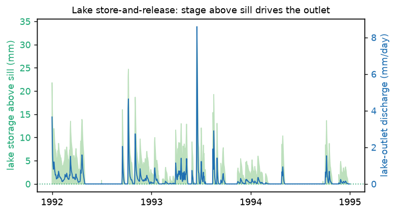
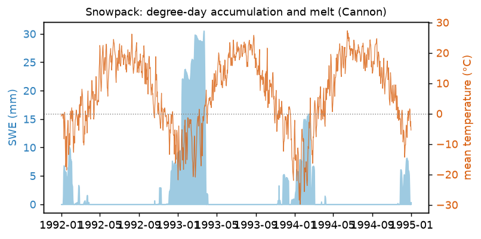
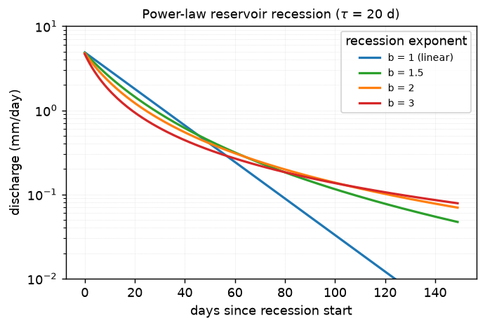
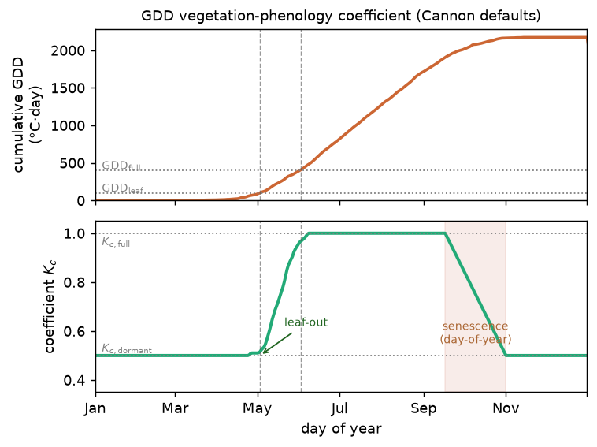

Model Description
==================

Theory & Mathematical Formulation
~~~~~~~~~~~~~~~~~~~~~~~~~~~~~~~~~~~

MNiShed is a lumped, daily-timestep conceptual hydrological model. A basin is
represented as one or more **parallel sub-catchments** — spatially distinct
hydraulic zones that drain to the same channel — each routing water through its
own cascade of reservoirs. The common case is a single sub-catchment spanning
the whole basin; several sub-catchments resolve zones with genuinely different
storage–discharge behaviour. Within each sub-catchment, water moves through
three sequential processes each day: optional snowpack accumulation/melt,
routing through cascading reservoirs (linear or nonlinear power-law), and
evapotranspiration. Basin streamflow is the area-weighted mean of the
sub-catchments.

.. graphviz::
   :align: center
   :caption: Model overview — precipitation passes through an optional snowpack
             into each parallel sub-catchment (a reservoir cascade, or a lake),
             whose discharges are area-weighted into basin streamflow;
             evapotranspiration is removed along the way.

   digraph overview {
       rankdir=LR;
       node [shape=box, style="rounded,filled", fillcolor=white,
             fontname="Helvetica", fontsize=10];
       edge [fontname="Helvetica", fontsize=9];

       P    [label="Precipitation", fillcolor="#eaf2fb"];
       snow [label="Snowpack\n(optional)\nSWE, degree-day melt"];
       et   [label="Evapotranspiration", shape=ellipse, fillcolor="#fbeaea"];
       Q    [label="Streamflow\n(area-weighted mean)", fillcolor="#eaf2fb"];

       subgraph cluster_sc {
           label="parallel sub-catchments";
           style=dashed; color="#999"; fontname="Helvetica"; fontsize=9;
           land [label="land zone\nreservoir cascade", fillcolor="#eef7ee"];
           lake [label="lake\nopen water + outlet", fillcolor="#eaf6ea"];
       }

       P -> snow;
       snow -> land; snow -> lake;
       land -> Q; lake -> Q;
       land -> lake [label="Q_gw, f_route", style=dashed, color="#3a7",
                     fontcolor="#3a7"];
       land -> et [style=dashed, dir=back, color="#c66", fontcolor="#c66"];
       lake -> et [style=dashed, dir=back, color="#c66"];
   }

All fluxes are expressed as depths over the drainage basin (mm/day).
Mass is conserved to within numerical precision.

Daily Water Balance
~~~~~~~~~~~~~~~~~~~

On each day, the model computes:

.. math::

    P + M - E = \Delta S + Q

where:

* :math:`P` = precipitation (mm/day)
* :math:`M` = snowmelt (mm/day)
* :math:`E` = evapotranspiration (mm/day)
* :math:`\Delta S` = change in storage (mm/day)
* :math:`Q` = streamflow (mm/day)

For a partitioned basin this balance holds within each sub-catchment; the basin
totals :math:`Q` and :math:`\Delta S` are the area-weighted sums over
sub-catchments (see :ref:`parallel-sub-catchments`).

.. _parallel-sub-catchments:

Spatial Structure: Sub-catchments
~~~~~~~~~~~~~~~~~~~~~~~~~~~~~~~~~~~

A basin is partitioned into :math:`K` **parallel sub-catchments** — spatially
distinct hydraulic zones that drain to the same channel in parallel rather than
in a vertical stack. The default is a single sub-catchment (:math:`K = 1`)
spanning the whole basin, which is exactly the reservoir cascade described
below. Several sub-catchments are used when a basin contains zones with
genuinely different storage–discharge behaviour — for example till uplands with
tile drainage alongside lake-clay lowlands — where a single cascade would
conflate a parallel structure into a serial one and could only partially
represent it.

Each sub-catchment :math:`k` is internally an ordinary vertical reservoir
cascade, with its own recession, junction, multipath, and tile-drain
parameters, and carries its own snowpack, frozen-ground, and carried-deficit
state. It occupies a basin-area fraction :math:`a_k`, with
:math:`\sum_{k=1}^{K} a_k = 1`. Sub-catchments are advanced independently each
day and produce per-unit-area discharge :math:`Q_k`; basin streamflow is their
area-weighted mean:

.. math::

    Q_{\text{basin}} = \sum_{k=1}^{K} a_k \, Q_k

.. graphviz::
   :align: center
   :caption: Sub-catchments drain to the same channel *in parallel*: each zone
             runs its own cascade (or is a lake) over a basin-area fraction
             :math:`a_k`, and the per-unit-area discharges are area-weighted into
             basin streamflow.

   digraph subcatchments {
       rankdir=LR;
       node [shape=box, style="rounded,filled", fillcolor="#eef7ee",
             fontname="Helvetica", fontsize=10];
       edge [fontname="Helvetica", fontsize=9];

       z1 [label="till upland\n(a = 0.5)"];
       z2 [label="tile-drained\n(a = 0.3)"];
       z3 [label="lake\n(a = 0.2)", fillcolor="#eaf6ea"];
       Q  [label="Q_basin = Σ aₖ Qₖ", shape=box, fillcolor="#eaf2fb"];

       z1 -> Q [label="a·Q₁"];
       z2 -> Q [label="a·Q₂"];
       z3 -> Q [label="a·Q₃"];
   }

Storage is area-weighted the same way (:math:`\sum_k a_k H_k`), so the basin
water balance is exact for any number of sub-catchments. With :math:`K = 1` and
:math:`a = 1` every aggregation is the identity, recovering the single-cascade
model exactly; existing single-cascade configurations are treated as precisely
that and need no changes.

All sub-catchments currently share the basin-level forcing (precipitation, ET,
temperature); per-sub-catchment forcing is a planned extension. The process
descriptions that follow are written for a single sub-catchment — when a basin
defines only one, "the sub-catchment" and "the basin" coincide. See
:ref:`sub-catchments-config` to configure a partitioned basin.

.. _lakes:

Lakes (open water)
~~~~~~~~~~~~~~~~~~~

A sub-catchment may instead be a **lake** (``kind: lake``): an open-water
element rather than a soil column. It is a single storage :math:`H_\text{lake}`
with a stage-driven outlet, fed by direct precipitation minus open-water
evaporation, and is area-weighted into basin streamflow exactly like a land
zone. Its balance per unit lake area is

.. math::

    \frac{\mathrm{d}H_\text{lake}}{\mathrm{d}t}
        = P - E_\text{open} + \frac{Q_\text{gw}}{a_\text{lake}}
          + f_\text{route}\,\frac{a_\text{land}}{a_\text{lake}}\,Q_\text{land}
          - Q_\text{out},

with four pieces of physics distinct from the soil cascade:

* **Outlet.** A threshold power-law stage–discharge relation,
  :math:`Q_\text{out} = a\,\max(H_\text{lake} - H_\text{sill},\,0)^{b}`, with
  :math:`b = 5/3` by default (a Manning friction-controlled river outlet;
  :math:`3/2` for a broad-crested-weir sill). Storage below :math:`H_\text{sill}`
  is a **dead pool** that does not discharge but keeps exchanging
  precipitation, evaporation, and groundwater.
* **Open-water evaporation.** :math:`E_\text{open}` reuses the basin ET (the
  global ``et_scale``), with no soil-moisture water-stress limit and without the
  vegetation phenology coefficient (open water has no leaf phenology; see the ET
  section). There is no separate Penman lake-ET term: at MNiShed's forcing
  resolution
  (temperature, precipitation, photoperiod) a Penman open-water formulation is
  collinear with the Thornthwaite land ET, so a distinct lake-ET module would
  add parameter degeneracy rather than information.
* **Groundwater exchange.** A bidirectional flux couples the lake to a land
  sub-catchment's deepest reservoir (head :math:`h_s`),

  .. math::

      Q_\text{gw} = a_\text{sub}\,\operatorname{sign}(h_s - H_\text{lake})\,
                    |h_s - H_\text{lake}|^{\,b_\text{sub}},

  reusing that reservoir's own recession coefficient and exponent — so it adds
  no calibrated parameter. The single signed term flips direction on its own:
  the aquifer feeds the lake when :math:`h_s > H_\text{lake}` and the lake
  recharges the aquifer when :math:`H_\text{lake} > h_s`, giving seasonal
  store-and-release buffering. The transfer conserves volume across the
  area-fraction difference (:math:`a_\text{land}\,\Delta H_\text{land} =
  a_\text{lake}\,\Delta H_\text{lake}`).
* **Channelized routing.** A fraction :math:`f_\text{route}` of the partner land
  zone's discharge :math:`Q_\text{land}` is routed *through* the lake instead of
  reaching the gauge directly: the lake gains
  :math:`f_\text{route}\,(a_\text{land}/a_\text{lake})\,Q_\text{land}` as inflow
  and that zone's contribution to basin streamflow is scaled by
  :math:`(1-f_\text{route})`. The transfer is **instantaneous** — there is no
  channel-travel lag — and it enters lake storage *before* the outlet step, so
  the lake takes immediate control of the water but releases it only through its
  stage–discharge law; the delay is provided by storage, not by the transfer.
  This is what lets the land cascade shed its storm discharge with the right
  buffering instead of counterfeiting slow release by stretching its recession
  timescale. Within a step the order is groundwater exchange, then routed
  inflow, then the outlet. :math:`f_\text{route}` is **data-derived** (the lake's
  position in the drainage network and the contributing-area fraction draining
  into it), never calibrated; :math:`f_\text{route} = 0` leaves the lake fed only
  by direct precipitation and :math:`Q_\text{gw}` (the appropriate setting for a
  terminal/closed lake). Channelized routing is a *distinct* mechanism from the
  soil cascade's ``multipath`` fast pathway (an engineered tile-drain
  representation): a lake buffers and re-releases routed surface water through an
  open-water outlet, whereas ``multipath`` is a threshold-activated fast drain
  within a soil reservoir. The two should not be substituted for one another.

   Lake store-and-release on the Cannon example: storage above the sill (green)
   drives the threshold power-law outlet (blue), so inflow is buffered and
   re-released slowly rather than passing straight to the gauge. Generated by
   ``docs/figures/plot_lake.py``.

Because the model's storages are conceptual depths rather than surveyed water
columns, :math:`H_\text{lake}` and :math:`H_\text{sill}` are conceptual, and the
outlet coefficient :math:`a` is an *effective* parameter that absorbs the
unknown translation from storage units to real stage and area — only the
exponent :math:`b` and the evaporation scale carry direct physical priors.
Automatically placing lakes in the drainage network and deriving
:math:`f_\text{route}` from terrain are planned with the drainage-density /
hydraulic-conductivity work; for now :math:`f_\text{route}` is supplied per lake
from data. See :ref:`lake-config` to configure a lake.

Optional Process Modules
~~~~~~~~~~~~~~~~~~~~~~~~~

Several processes can be individually enabled or disabled through the
``modules`` block in the configuration file (see :doc:`configuration`).
All modules that require temperature data are silently inactive when
``Mean Temperature [C]`` is absent from the input CSV, regardless of
their flag setting.

.. list-table::
   :widths: 20 10 60
   :header-rows: 1

   * - Module
     - Default
     - Purpose
   * - ``snowpack``
     - on
     - Accumulation, PDD melt, sublimation, and rain-on-snow.
   * - ``frozen_ground``
     - on
     - Frozen ground index (FGI) that blocks deep infiltration.
       Requires ``snowpack: true``.
   * - ``rain_on_snow``
     - on
     - Sensible-heat contribution of warm rain on snowpack.
       Requires ``snowpack: true``.
   * - ``direct_runoff``
     - off
     - Hortonian-inspired bypass fraction. See below.
   * - ``dtr_fgi_decay``
     - on
     - DTR-based FGI decay. When T_min/T_max columns are present, the
       per-day decay coefficient varies with the diurnal temperature
       range. Disable to revert to constant ``fgi_decay_coeff``
       (original Molnau & Bissell behaviour). See Frozen Ground Module.

Snowpack Module (Optional)
~~~~~~~~~~~~~~~~~~~~~~~~~~

If mean air temperature is provided, snowpack processes are enabled.

**Accumulation:**
  When :math:`T \leq 0°C`, net water input (precipitation minus ET) accumulates
  as snow (stored as SWE):

  .. math::

      \text{SWE}_{t+1} = \text{SWE}_t + (P_t - E_t)

**Melt:**
  When :math:`T > 0°C`, melt is computed using the positive-degree-day (PDD) approach:

  .. math::

      M_t = \min(\text{SWE}_t,\ \alpha \cdot T_t \cdot \Delta t + M_{\text{ROS},t})

  where :math:`\alpha` is the melt factor (mm SWE °C⁻¹ day⁻¹) and
  :math:`M_{\text{ROS}}` is the rain-on-snow sensible-heat contribution
  (see below). All melt is routed directly to the top reservoir.

   Modeled snow-water equivalent against mean temperature on the Cannon example:
   SWE accumulates while the temperature is below freezing and melts by the
   positive-degree-day rule once it rises above 0 °C. Generated by
   ``docs/figures/plot_snowpack.py``.

**Rain-on-snow (ROS) sensible heat:**
  Rain arriving at temperature :math:`T > 0°C` carries thermal energy that
  can melt additional snow:

  .. math::

      M_{\text{ROS},t} = \frac{c_p}{L_f} \cdot T_t \cdot P_t

  where :math:`c_p / L_f \approx 0.01253\ °C^{-1}` is the ratio of the
  specific heat of water to the latent heat of fusion. This term is
  typically small relative to the PDD term except during warm rain-on-snow
  events (McCabe et al. 2007; Würzer et al. 2016).

**ET deficit:**
  When precipitation minus ET is negative, the deficit first sublimates
  snow:

  .. math::

      \text{Sublimation} = \min\!\left(\text{SWE}_t,\ \max(0,\ E_t - P_t)\right)

  Any deficit exceeding available SWE is passed to the top subsurface
  reservoir and, if still unmet, carried forward to the next time step.

Frozen Ground Module (Optional)
~~~~~~~~~~~~~~~~~~~~~~~~~~~~~~~~

When a ``fdd_threshold`` is set, the model tracks a **frozen ground index**
(FGI; Molnau & Bissell 1983) that accumulates freezing degree-days,
decays passively each day, and additionally decays during warm periods:

.. math::

    \text{FGI}_t = \max\!\left(0,\ A \cdot \text{FGI}_{t-1} - T_{\text{eff},t} - D_t\right)

where :math:`A_t` is the daily decay coefficient (see below),
:math:`T_{\text{eff},t} = T_t \cdot e^{-k \cdot \text{SWE}_t}` is the
snow-insulation-adjusted temperature (°C; negative values increase FGI,
positive values reduce it), and :math:`D_t` is an additional thaw credit
described below. When :math:`\text{FGI}_t` exceeds ``fdd_threshold``,
the top reservoir's exfiltration fraction is set to 1.0 so that all
drainage becomes direct runoff, simulating frozen-soil blockage of deep
infiltration.

**DTR-based decay coefficient** :math:`A_t`:
  The decay coefficient :math:`A_t` represents sub-daily heat input to
  frozen soil that is not resolved by the daily-mean temperature forcing.
  Its dominant physical driver is the fraction of the day when air
  temperature is above 0°C even though the daily mean is negative —
  a process that is frequent in maritime climates (Pacific Northwest,
  Atlantic Europe) and rare in continental ones (central North America,
  Siberia).

  When daily minimum and maximum temperature columns
  (``Minimum Temperature [C]``, ``Maximum Temperature [C]``) are present
  in the input CSV, :math:`A_t` is computed from the diurnal temperature
  range (DTR):

  .. math::

      f_{\text{above}} = \frac{\max(0,\ T_{\max,t})}
                              {T_{\max,t} - T_{\min,t}}

      A_t = 1 - (1 - A_0)\,f_{\text{above}}

  where :math:`A_0` is ``fgi_decay_coeff`` (default 0.97, M&B 1983) and
  :math:`f_{\text{above}}` is the fraction of the day above 0°C under a
  linear diurnal-cycle assumption. On days entirely below freezing
  (:math:`T_{\max} \leq 0`), :math:`A_t = 1.0` — no passive decay;
  FGI accumulates unimpeded. When the diurnal cycle straddles 0°C,
  :math:`A_t` falls toward :math:`A_0`. This naturally produces
  near-unity :math:`A` for continental winters (where :math:`T_{\max}`
  rarely crosses 0°C during cold spells) and M&B-like decay for maritime
  climates with frequent overnight freeze–daytime thaw cycles.

  ``fgi_decay_coeff`` thus represents the *maximum* daily decay rate,
  reached when the entire cold day oscillates across 0°C. The steady-state
  :math:`\text{FGI}^* = |T| / (1 - A_t)` is now climate-dependent:
  large (persistent frost) for continental conditions, bounded for
  maritime ones.

  If T_min/T_max are absent, :math:`A_t` falls back to the constant
  ``fgi_decay_coeff`` (original M&B behaviour).

**Coupling snowmelt and frozen-ground thaw via the melt factor:**
  The PDD melt factor :math:`\alpha` has units of mm SWE per °C·day,
  making it a natural conversion factor between the thermal forcing
  (°C·day) and a water-equivalent depth (mm SWE):

  .. math::

      \text{mm SWE} = \alpha \cdot \text{°C·day}
      \qquad \Longleftrightarrow \qquad
      \text{°C·day} = \frac{\text{mm SWE}}{\alpha}

  When total melt energy in a timestep exceeds the available SWE, the
  leftover energy :math:`\Delta E` is expressed in mm SWE. Dividing by
  :math:`\alpha` converts it back to degree-days — the same currency the
  FGI uses — so the residual can be credited toward thawing frozen ground:

  .. math::

      D_t = \frac{\max(0,\ \alpha T_t \Delta t + M_{\text{ROS},t} - \text{SWE}_t)}{\alpha}

  This means that once the snowpack is fully depleted, any remaining
  thermal energy continues to thaw frozen soil rather than being
  discarded. The melt factor thus serves as the bridge between the two
  empirical degree-day representations.

  Note that :math:`\alpha` characterises the snow surface, not the soil.
  Applying the same conversion to the soil implicitly assumes that the
  atmosphere-to-surface thermal coupling is the same in both cases, which
  is a simplification. Within a degree-day framework, however, the
  approach is internally self-consistent.

**Snow insulation:**
  A deep snowpack buffers the soil surface from cold air, reducing the
  effective freezing degree-days that accumulate in the FGI. This is
  represented by an exponential insulation factor:

  .. math::

      T_{\text{eff},t} = T_t \cdot e^{-k \cdot \text{SWE}_t}

  where :math:`k` (mm⁻¹ SWE) is the snow insulation decay constant
  (``snow_insulation_k`` in the ``snowmelt`` config section; default
  0.0). The factor is applied to both freezing and thawing temperature
  forcing; meltwater heat delivery (``excess_dd``) is not scaled because
  meltwater reaches the soil surface directly. The parameterisation
  originates in Molnau & Bissell (1983), and was adopted by LISFLOOD
  (van der Knijff et al. 2010) and GSSHA (Downer & Ogden 2004).

  .. note::

      ``snow_insulation_k`` and ``fdd_threshold`` are correlated: both
      control how much frozen-ground effect the model sees. Calibrating
      them simultaneously from streamflow alone leads to equifinality —
      the optimizer trades a near-zero threshold against moderate
      insulation rather than finding physically meaningful values for
      either. Recommended practice:

      * Fix ``snow_insulation_k`` at a literature or field-derived value
        and calibrate only ``fdd_threshold``, or
      * Leave ``snow_insulation_k = 0`` (default) and treat
        ``fdd_threshold`` as the sole free FGI parameter.

      The insulation term is most useful when independent observations
      (soil temperature, frost depth) are available to constrain
      :math:`k`, or for deep-snowpack alpine catchments where the
      insulation effect is large relative to the threshold uncertainty.

Regional Groundwater Import (Optional)
~~~~~~~~~~~~~~~~~~~~~~~~~~~~~~~~~~~~~~~

When ``baseflow_Q > 0`` in the ``catchment`` configuration section, a
constant daily flux (mm/day) is added to modeled discharge after all
reservoir routing:

.. math::

    Q_{\text{out},t} = Q_{\text{routed},t} + Q_{\text{base}}

This represents regional groundwater inflow from outside the surface
catchment — for example, deep confined-aquifer discharge or inter-basin
transfer that is decoupled from the local shallow water balance.
:math:`Q_{\text{base}}` is not mass-balanced against precipitation or
ET; it adds water to the stream without a corresponding source in the
reservoir cascade.

Use with care: ``baseflow_Q`` is most physically justified when
independent hydrogeological evidence supports an external groundwater
source (artesian springs, regional flow systems). Calibrating it from
streamflow alone risks compensating for other structural deficiencies
in the model.

Direct Runoff Bypass (Optional)
~~~~~~~~~~~~~~~~~~~~~~~~~~~~~~~~

When ``direct_runoff: true`` in the ``modules`` block, a fixed fraction
:math:`\gamma` of positive daily recharge is intercepted before it enters
the top reservoir and routed directly to the stream:

.. math::

    Q_{\text{direct},t} = \gamma \cdot \max(0,\ R_t)

    R_{\text{remaining},t} = (1 - \gamma) \cdot R_t

where :math:`R_t` is the recharge available after ET (mm/day) and
:math:`\gamma` is ``direct_runoff_fraction`` in the ``general``
configuration section.

This formulation is *Hortonian-inspired* — conceptually motivated by
infiltration-excess overland flow — but cannot be a rigorous
physical representation at the daily timestep. Without sub-daily
intensity data, it is impossible to determine whether the daily
precipitation total actually exceeds hydraulic conductivity at any
moment. The bypass may nonetheless provide a useful empirical
correction for catchments with significant impervious area, compacted
soils, or urban fractions, and for days dominated by a single intense
storm event (Yilmaz et al. 2008).

The module is off by default (``direct_runoff: false``). Unless the
calibration objective clearly demands it, leaving it off is recommended
to avoid equifinality: the bypass can mimic effects already represented
by the shallow-reservoir timescale, causing parameters to lose their
intended physical interpretation.

Linear Reservoir Cascade
~~~~~~~~~~~~~~~~~~~~~~~~

Within a sub-catchment, water drains through a stack of reservoirs (top =
shallowest, bottom = deepest). Each reservoir first receives its recharge
input, then drains by exponential decay:

.. math::

    Q_i(t) = \bigl(H_i(t) + Q_{\text{recharge},i}\bigr) \cdot (1 - e^{-\Delta t / \tau_i})

where:

* :math:`H_i` = water depth in reservoir :math:`i` at the start of the time step (mm)
* :math:`Q_{\text{recharge},i}` = water input to reservoir :math:`i` this time step (mm)
* :math:`\tau_i` = e-folding residence time (days)
* :math:`\Delta t` = time step (1 day)

**Discharge Partitioning:**
  Of the water drained from reservoir :math:`i`, a fraction :math:`f_i` exits as 
  river discharge; the remainder infiltrates to the next layer:
  
  .. math::
  
      Q_{\text{discharge},i} = f_i \cdot Q_i \\
      Q_{\text{infiltrate},i} = (1 - f_i) \cdot Q_i

**Constraint:**
  The bottom reservoir should fully discharge (:math:`f_{\text{bottom}} = 1.0`).
  A warning is issued if not, as this violates mass conservation.

.. graphviz::
   :align: center
   :caption: The vertical reservoir cascade. Recharge enters the top (shallow)
             reservoir; each reservoir exfiltrates a fraction :math:`f_i` of its
             drainage to the stream and passes the rest down. The bottom
             reservoir discharges fully (:math:`f = 1`).

   digraph cascade {
       rankdir=TB;
       node [shape=box, style="rounded,filled", fillcolor="#eef7ee",
             fontname="Helvetica", fontsize=10];
       edge [fontname="Helvetica", fontsize=9];

       rech   [label="recharge\n(P − E, or snowmelt)", fillcolor="#eaf2fb"];
       r0     [label="reservoir 0 — soil zone\nτ₀, b₀"];
       r1     [label="reservoir 1 — groundwater\nτ₁, b₁"];
       stream [label="stream", fillcolor="#eaf2fb"];

       rech -> r0;
       r0 -> stream [label="f₀ · Q₀  exfiltrate"];
       r0 -> r1     [label="(1 − f₀) · Q₀  infiltrate"];
       r1 -> stream [label="f₁ = 1 · Q₁"];
   }

**Storage Update:**
  Recharge is applied first, then exponential drainage:

  .. math::

      H_i(t+1) = \bigl(H_i(t) + Q_{\text{recharge},i}\bigr)\,e^{-\Delta t/\tau_i}

  Overflow above :math:`H_{\max}` exits immediately as direct runoff; any
  deficit is passed to the next-deeper reservoir. ET is not subtracted
  separately at the reservoir level — it is already incorporated into the
  recharge input to the top reservoir.

**Physical interpretation:**
  No reservoir is fixed to a particular process; meaning is set by
  parameter choice. Successive reservoirs naturally span progressively
  longer timescales — interflow (days), soil moisture (months),
  groundwater (years) — but that mapping is the user's choice, analogous
  to the multi-component runoff structure of HBV (Bergström 1976).

.. _reservoir-junctions:

Junctions Between Reservoirs (Optional)
~~~~~~~~~~~~~~~~~~~~~~~~~~~~~~~~~~~~~~~~~

The discharge partitioning above sends a fixed fraction :math:`f_i` of each
reservoir's drainage to the stream and the remainder to the next-deeper
reservoir. This fixed split is the default *junction* — the rule that sets
how drained water is routed where one reservoir meets the one beneath it.
Two further junction types let that routing depend on the physical state of
the reservoirs rather than on a fixed fraction. The junction type is chosen
per reservoir, and types may be mixed within a single cascade.

**Fraction junction (default).**
  The drained water :math:`Q_i` splits by the constant fraction :math:`f_i`:
  :math:`f_i Q_i` to the stream and :math:`(1 - f_i)\,Q_i` to the next
  reservoir, independent of storage. This is the standard linear-cascade
  behaviour described above, and the default for every reservoir.

**Leakance junction.**
  Flow to the next-deeper reservoir is driven by the difference in water
  level between the two reservoirs rather than by a fixed fraction — a
  representation of Darcy flow through a confining unit (e.g. a clay or
  shale layer) that separates two aquifers. With :math:`H_i` the water level
  in this reservoir and :math:`H_{i+1}` that in the next, the downward flux
  is

  .. math::

      Q_{\text{infiltrate},i} = \min\!\left( Q_i,\;
          \frac{\max(H_i - H_{i+1},\, 0)}{R_i} \right) ,

  where :math:`R_i` is the *leakance resistance* (days): a larger :math:`R_i`
  more strongly impedes flow between the reservoirs. Water moves downward
  only when :math:`H_i > H_{i+1}`, and the flux cannot exceed the drainage
  :math:`Q_i` available in the time step. Whatever is not passed downward
  exits to the stream,

  .. math::

      Q_{\text{discharge},i} = Q_i - Q_{\text{infiltrate},i} .

  The exfiltration fraction :math:`f_i` is not used for a leakance junction.

**Threshold junction.**
  A dead-storage threshold :math:`H_{\text{thr},i}` below which the
  reservoir does not drain. The recession law acts only on the storage above
  the threshold,

  .. math::

      H_{\text{eff},i} = \max(H_i - H_{\text{thr},i},\, 0) ,

  so water below :math:`H_{\text{thr},i}` is retained indefinitely. This
  represents a stream–aquifer connection that switches off once the water
  table drops below the streambed elevation: baseflow stops below a storage
  threshold rather than decaying smoothly toward zero. Above the threshold,
  the drainage splits by :math:`f_i` exactly as in the fraction junction.

Use a non-default junction only where there is physical reason for it — a
known confining layer between two aquifers, or an observed baseflow cutoff.
The fraction junction remains the parsimonious default, and adding a
leakance resistance or a dead-storage threshold introduces a parameter that
the data must be able to constrain.

Nonlinear (Power-Law) Recession (Optional)
~~~~~~~~~~~~~~~~~~~~~~~~~~~~~~~~~~~~~~~~~~~

Each reservoir can optionally use a power-law storage–discharge relationship
in place of the default linear (exponential) decay. The discharge rate scales
as a power of storage:

.. math::

    Q_i = \frac{H_i}{\tau_i} \left(\frac{H_i}{H_{\text{ref}}}\right)^{b_i - 1}

where :math:`b_i \geq 1` is the recession exponent for reservoir :math:`i`
and :math:`H_{\text{ref}} = 1` mm is a fixed reference storage that
nondimensionalises the storage ratio. (:math:`H_{\text{ref}}` is a redundant
gauge: only the product :math:`\tau_i\,H_{\text{ref}}^{\,b_i-1}` is
identifiable from data, so it is held at 1 mm and the coefficient
:math:`\tau_i` absorbs it.) Setting :math:`b_i = 1` recovers the linear
reservoir exactly.

   Recession of a single reservoir from a common initial storage for several
   exponents :math:`b` (log discharge). :math:`b = 1` is the linear reservoir (a
   straight line); larger :math:`b` drains faster early and slower late, holding a
   fatter low-flow tail. Generated by
   ``docs/figures/plot_reservoir_recession.py``.

.. warning::

   **The recession coefficient is not a residence time.** For a nonlinear
   reservoir (:math:`b > 1`), :math:`\tau` (``recession_coeff`` /
   ``recession_coefficients``) is a drainage *constant* with units
   :math:`\mathrm{day}\cdot\mathrm{mm}^{\,b-1}` — it is an e-folding timescale
   in days *only* for the linear case :math:`b = 1`. The physical residence
   time of a nonlinear reservoir is **not a single number**: it lengthens as
   flow and storage fall. Read it with
   :meth:`~mnished.Reservoir.mean_residence_time` at a representative
   :math:`Q_{\text{ref}}`; never interpret a calibrated :math:`\tau` for
   :math:`b > 1` directly as days.

For :math:`b > 1`, the relationship is superlinear: high-storage states drain
faster than the linear equivalent, and as storage depletes the drainage rate
slows more rapidly. This behaviour is observed in natural catchments and has
theoretical grounding in subsurface flow geometry (Brutsaert & Nieber 1977;
Kirchner 2009). Brutsaert & Nieber (1977) derived :math:`b \approx 2.2` from
analysis of recession hydrographs; individual catchments and reservoirs may
deviate substantially from this value.

.. note::

    **Which reservoir does B–N represent?**
    The lower envelope of the Brutsaert–Nieber recession plot corresponds to
    the *slowest clearly observable* recession pathway — not necessarily the
    deepest reservoir.  A truly deep groundwater reservoir (mean residence time
    of decades to centuries) contributes discharge that is so small and so
    nearly constant that it is indistinguishable from noise at typical gauge
    resolution; it does not dominate any part of the recession cloud.  The
    lower envelope instead reflects the *intermediate* subsurface zone
    (shallow Quaternary units, outwash lenses, fractured regolith) whose
    mean residence time is days to weeks — slow enough to persist through
    multi-day recessions, fast enough to register clearly above baseflow.

    Practical implication: apply the B–N-derived :math:`b` to the
    **intermediate** reservoir, not the deepest one.  Fix the deepest
    reservoir at :math:`b = 1` (linear Darcy flow in a confined or
    semi-confined aquifer), which avoids adding a free parameter for a
    process that the streamflow record cannot constrain.  Calibration
    experiments on the Cannon River (Wickert 2026) confirm this assignment:
    the B–N lower-envelope value :math:`b \approx 2.2` matches the
    intermediate reservoir optimum, while the deep reservoir (MRT ~ 137 yr)
    produces discharge too small to appear in the B–N cloud.

Mean Residence Time for Nonlinear Reservoirs
^^^^^^^^^^^^^^^^^^^^^^^^^^^^^^^^^^^^^^^^^^^^^

Because :math:`\tau` is defined as the drainage timescale specifically at
the 1 mm reference storage :math:`H_{\text{ref}}`, it is **not directly
comparable** across reservoirs with different recession exponents. Two
reservoirs with identical :math:`\tau` but different :math:`b` drain at
very different rates at any realistic storage depth above 1 mm, because
the power-law nonlinearity amplifies (for :math:`b > 1`) or suppresses the
drainage rate relative to the linear case.

.. _mean-residence-time:

A physically meaningful alternative is the **mean residence time** (MRT)
at a representative steady-state discharge :math:`Q_{\text{ref}}`. At
steady state the outflow equals the input, so
:math:`Q_{\text{ref}} = H_{ss}^b / \tau`, giving:

.. math::

    H_{ss} = \bigl(Q_{\text{ref}}\cdot\tau\bigr)^{1/b}

    \text{MRT} = \frac{H_{ss}}{Q_{\text{ref}}} =
        \frac{\tau^{1/b}}{Q_{\text{ref}}^{\,1-1/b}}

For :math:`b = 1` (linear) this reduces exactly to :math:`\tau`,
consistent with the standard result for exponential decay. For
:math:`b > 1`, MRT is smaller than :math:`\tau` whenever
:math:`Q_{\text{ref}} > 1` mm/day, reflecting the accelerated drainage at
operating storage depths well above :math:`H_{\text{ref}}`.

MRT is implemented as
:meth:`~mnished.mnished.Reservoir.mean_residence_time`::

    mrt = reservoir.mean_residence_time(Q_ref=0.5)  # [mm/day] → [days]

**Choosing** :math:`Q_{\text{ref}}`: use the long-term mean discharge
attributed to the reservoir. For a cascade this is approximately the
mean annual flux passing through that layer. The result is most useful
as a cross-experiment or cross-basin diagnostic; its absolute value
depends on the chosen reference flux.

**Worked example.** Two soil reservoirs both fitted with :math:`\tau = 100`
but with :math:`b = 2` versus :math:`b = 4` look like the *same* parameter as
raw coefficients, yet their residence times differ — and both lengthen as
flow falls:

.. list-table::
   :widths: 34 33 33
   :header-rows: 1

   * - :math:`Q_{\text{ref}}` [mm day⁻¹]
     - MRT, :math:`b = 2` [days]
     - MRT, :math:`b = 4` [days]
   * - 1.0
     - 10.0
     - 3.2
   * - 0.1
     - 31.6
     - 17.8

The raw coefficient :math:`\tau` hides both the cross-:math:`b` difference and
the flow dependence; :meth:`~mnished.Reservoir.mean_residence_time` makes them
explicit.

.. note::

    Calibration studies (Wickert 2026) show that raw :math:`\tau` values
    for strongly nonlinear reservoirs (:math:`b \approx 4`–5, typical of
    tile-drain-influenced soil zones) can differ by more than an order of
    magnitude between experiments while MRT remains nearly constant at
    ~5–6 days, because the optimizer adjusts :math:`\tau` to compensate
    for changes in :math:`b` and the operating storage level. MRT is
    therefore the recommended diagnostic for comparing calibrated
    timescales across experiments or basins, and should be reported
    alongside :math:`\tau` and :math:`b` whenever the recession exponent
    differs among reservoirs.

Saturation-Excess Runoff (PDM, Optional)
~~~~~~~~~~~~~~~~~~~~~~~~~~~~~~~~~~~~~~~~~

The probability-distributed model (PDM; Moore 1985) represents spatial
variability in soil storage capacity within a reservoir. Storage capacities
are assumed to follow an exponential distribution with mean :math:`H_0`
(``pdm_H0``). When the reservoir storage :math:`H` is positive, the
fraction of the area already saturated is:

.. math::

    f_{\text{sat}} = 1 - e^{-H / H_0}

That fraction of each day's positive recharge runs off immediately as
saturation-excess overland flow; the remainder enters the reservoir normally.
Setting a very large :math:`H_0` renders the PDM effectively inactive.

.. note::

    **PDM and power-law recession are equifinal.** Both produce nonlinear
    storage–discharge behaviour, but through different mechanisms: the PDM
    uses a sharp storage threshold (saturation-excess), while power-law
    recession is a smooth, continuous relationship. When both are active and
    calibrated simultaneously against streamflow alone, the optimizer can trade
    one against the other without penalty, obscuring the physical meaning of
    each parameter.

    Calibration experience on the Cannon River (Wickert 2026) shows that when
    the recession exponent :math:`b` is free, the PDM characteristic depth
    :math:`H_0` is driven to large values (effectively inactive), and vice
    versa: when PDM is removed, :math:`b` rises to compensate. The two
    mechanisms are redundant for the purpose of matching a streamflow record.

    **Recommended practice:** use one or the other, not both.

    * Power-law recession (:math:`b > 1`) is preferred when the goal is a
      smooth, theoretically grounded nonlinearity. It has a direct connection
      to subsurface flow theory (Brutsaert & Nieber 1977; Kirchner 2009) and
      avoids the threshold artifact.
    * PDM is preferred when independent evidence (saturation mapping, soil
      moisture observations) supports a genuine threshold process.

**On shallow reservoirs, tile drains, and macropore flow:**
  The same equifinality argument extends to structural choices about reservoir
  count and fast-pathway modules. A shallow reservoir with a short timescale,
  a tile-drain bypass, or a macropore fraction all represent fast, near-surface
  runoff generation. If the soil-zone recession exponent is calibrated and found
  to be robustly high (:math:`b \approx 3`–:math:`4`), the soil reservoir is
  already capturing this fast-response behavior through its nonlinear
  storage–discharge relationship. Adding a separate shallow reservoir, tile, or
  macropore pathway then produces similar discharge dynamics with additional
  parameters, potentially leading to false conclusions because the parameter
  names imply distinct physical mechanisms that the data cannot distinguish.

  The same equifinality extends to the frozen-ground module. Frozen-ground
  blockage of infiltration during winter and early spring produces elevated
  fast discharge — the same behavioral signature as a nonlinear soil recession
  with high :math:`b`. When both are active and calibrated simultaneously,
  the optimizer may drive the frozen-ground parameters (``fdd_threshold``,
  ``snow_insulation_k``) toward values that effectively disable the module,
  with :math:`b_{\text{soil}}` compensating. Streamflow alone cannot
  distinguish frozen-soil bypassing from high-storage nonlinear drainage.

  Unless there is independent process evidence (tile-drain monitoring, tracer
  data, direct macropore observations, or soil temperature / frost-depth records)
  that requires a mechanistically separate fast or frozen pathway, prefer
  calibrating :math:`b_{\text{soil}}` and accepting the result as an effective
  representation of the aggregate fast-response behavior of the soil zone.

Suggested Model Structures
~~~~~~~~~~~~~~~~~~~~~~~~~~~

The following guidelines summarise current knowledge on how to translate
basin characteristics into model structure choices.  They are not universal
rules; the appropriate structure for a given basin should be confirmed by
AIC comparison (see :doc:`calibration`).

**Choosing the number of reservoirs:**
  Two reservoirs (soil + groundwater) are sufficient for many basins and
  serve as a useful structural null hypothesis.  A third reservoir is
  warranted when the recession cloud or hydrograph separation identifies
  a clearly distinct intermediate timescale (days to weeks) that cannot
  be captured by adjusting the two-reservoir parameters.  Adding reservoirs
  beyond three rarely improves AIC because the additional timescale is
  seldom independently identifiable from daily discharge alone.

**Assigning recession exponents:**
  The Brutsaert–Nieber (1977) lower-envelope slope from the recession cloud
  gives the recession exponent for the intermediate reservoir — the slowest
  pathway observable in the daily record.  See :doc:`recession_analysis`.

  * Soil/fast reservoir: calibrate freely (typical range 2–6 for agricultural
    or mixed catchments; reflects tile drainage or near-surface nonlinearity)
  * Intermediate reservoir: fix at the B–N lower-envelope estimate for the
    basin; do not calibrate unless the lower envelope is poorly defined
  * Deep reservoir: fix at :math:`b = 1` (linear); the timescale is too long
    and the flux too small for the recession cloud to constrain :math:`b`

**Choosing the ET mode:**
  ``et_reservoir_draw: true`` is recommended when the model has a
  calibrated soil reservoir.  ET draws from post-cascade soil storage,
  providing a zero-parameter temporal buffer equal to the soil MRT.
  Use ``enforce_water_balance: 'global'`` alongside it to avoid hidden
  per-year degrees of freedom that would complicate AIC comparisons.

**Frozen-ground and fast-drainage modules:**
  Use at most one of: frozen ground (``frozen_ground: true``), tile drains
  (``tile_fractions > 0`` or ``multipath_thresholds__mm`` set),
  direct runoff (``direct_runoff: true``), PDM (``pdm_H0__mm``), or a high
  calibrated :math:`b_{\text{soil}}`.  All these mechanisms generate the
  same behavioral signature (fast spring or event-driven pulse) and are
  equifinal when calibrated simultaneously from streamflow alone.  The
  simplest first choice is to calibrate :math:`b_{\text{soil}}` and leave
  the others inactive; activate one of the explicit modules only if
  independent process evidence supports it.

**Two tile-drain representations:**
  MNiShed supports two distinct mechanisms for representing agricultural
  tile drainage. They model different physics; both have legitimate uses,
  but they are not interchangeable and should not be combined for the same
  process without good reason.

  *Fractional-bypass tile* (``tile_fractions`` + ``tile_residence_times__days``,
  i.e. ``f_tile`` / ``tau_tile``).
  A constant fraction of the parent reservoir's recession outflow is
  diverted into a separate downstream linear sub-reservoir, which then
  drains directly to stream with timescale :math:`\tau_\text{tile}`.
  Mathematically:
  :math:`Q_\text{tile} = f_\text{tile} \cdot Q_\text{next}` (routed
  through a downstream tile reservoir). The split is *storage-state
  independent*: the same fraction applies whether the parent reservoir
  is empty or full. Conceptually represents distributed fast pathways
  (macropores, perched lenses, partly-drained tile networks) that
  intercept a roughly constant share of percolating water.

  *Multipath threshold-activated drain* (``multipath_thresholds__mm`` +
  ``multipath_timescales__days``).
  A second outflow path operates directly from the parent reservoir's
  storage, active only when storage exceeds a threshold:
  :math:`Q_\text{mp} = \max(0, H - H_\text{thr})/\tau_\text{mp}`,
  added in parallel to the primary recession. The drain is
  *storage-state dependent*: it contributes nothing below the threshold
  and an additional linear drainage above it. Conceptually represents a
  tile-drain network at a fixed installation depth that activates only
  when the water table rises above drain elevation. The resulting
  hydrograph response has two distinct timescales (slow matrix
  recession below threshold; combined faster recession above), which
  is consistent with a Brutsaert–Nieber recession exponent slightly
  above 1 with modest scatter — the signature of two parallel linear
  drainage regimes.

  Choose ``f_tile`` / ``tau_tile`` when you expect the fast pathway
  to be active across the full range of storage states (always-on
  bypass). Choose ``multipath_*`` when there is a physical activation
  depth and the fast response should only fire in wet conditions. The
  two mechanisms can in principle be combined on the same reservoir but
  the resulting identifiability problem is severe; default to using one
  at a time.

Evapotranspiration
~~~~~~~~~~~~~~~~~~

MNiShed handles ET in three stages: an **estimate** of demand, a
**water-balance correction** that turns it into the ET the model targets,
and an **application** pathway that removes it from storage. The figure
traces these stages; the methods and modes are detailed below.

.. graphviz::
   :align: center
   :caption: Evapotranspiration in MNiShed — estimate, water-balance
             correction, and the three application pathways.

   digraph et_pathways {
       rankdir=TB;
       node [shape=box, style="rounded,filled", fillcolor=white,
             fontname="Helvetica", fontsize=10];
       edge [fontname="Helvetica", fontsize=9];

       temp [label="Temperature\n(Tmax, Tmin, photoperiod)"];
       file [label="Datafile\n(externally known ET)"];

       uncorr [label="Uncorrected ET\n'Evapotranspiration [mm/day]'\nBMI input",
               fillcolor="#eaf2fb"];
       corr   [label="Corrected ET (target)\n'ET for model [mm/day]'\nBMI output",
               fillcolor="#eaf2fb"];

       pd [label="default:\nsubtracted in P - E recharge"];
       ps [label="et_water_stress:\nscaled by 1 - exp(-H/H0)"];
       pr [label="et_reservoir_draw:\ndrawn post-cascade, capped at\nstorage / wilting point"];

       actual [label="Actual ET removed from storage\n(= target by default;\n<= target under stress modes)",
                fillcolor="#eef7ee"];

       temp -> uncorr [label="Thornthwaite-Chang"];
       file -> uncorr [label="as supplied"];
       uncorr -> corr [label="× water-balance multiplier\n(water-year | global | none); × et_scale"];
       corr -> pd;
       corr -> ps;
       corr -> pr;
       pd -> actual;
       ps -> actual;
       pr -> actual;
   }

The uncorrected estimate is the input CSV column
``Evapotranspiration [mm/day]`` (BMI input
``…__uncorrected_evapotranspiration_volume_flux``); the corrected target is
``ET for model [mm/day]`` (BMI output
``…__evapotranspiration_volume_flux``). The two coincide only when
``enforce_water_balance: 'none'``, and the ET *actually removed* equals the
target except under ``et_water_stress`` / ``et_reservoir_draw``, where
storage availability reduces it.

Two methods are supported:

**Method 1: From Data**
  ET is read directly from the input CSV and scaled to close the annual water balance:

  .. math::

      E_{\text{scaled}} = E_{\text{observed}} \cdot \frac{P_{\text{annual}} - Q_{\text{observed,annual}}}{ET_{\text{observed,annual}}}

**Method 2: Thornthwaite-Chang (2019)**
  Daily reference ET (:math:`ET_0`) is estimated from temperature and photoperiod:

  .. math::

      ET_0 = \text{f}(T_{\max}, T_{\min}, \text{photoperiod})

  Then scaled by water year to match observed P − Q balance.

In both cases, the annual scaling factor is stored and applied to ensure that
:math:`P - Q - E = 0` over each water year.

.. note::

   Because Thornthwaite-Chang derives ET from temperature alone, it mis-times
   the seasonal ET cycle wherever vegetation phenology is decoupled from
   temperature — most notably in cold-region forests, where canopy leaf-out
   lags spring warming, so early-spring ET is over-estimated and can consume the
   snowmelt freshet. The annual water-balance scaling then redistributes that
   bias into other seasons. See the warning under ``evapotranspiration_method``
   in :doc:`configuration`; prefer measured (``datafile``) ET where phenology and
   temperature are out of phase.

**Accepting the phasing error vs. updating the ET mechanics.** Thornthwaite-Chang
trades forcing parsimony — temperature is the only input — for phase accuracy, so
a basin whose ET is decoupled from temperature inherits a *structural* seasonal
residual. Because ``et_scale`` is an annual factor, it can only redistribute that
bias between seasons, never remove it. The choice is therefore per-application:
**accept** the residual when the target signal is insensitive to seasonal phase
(annual yield, multi-decade trends, drought totals), recognizing the spring/fall
mismatch as method rather than model error; **update** the ET mechanics when phase
*is* the signal (freshet timing, low-flow recession, seasonal water balance) by
supplying measured ET (``datafile``), a thermal-time (growing-degree-day)
phenology factor derived from the temperature record itself, a phenology factor
that follows observed green-up (e.g. NDVI), or an energy-based method once the
necessary radiation, wind, and humidity forcings are available. The thermal-time
option is the most parsimonious of these — it needs no forcing beyond the daily
temperature already required, and suppresses early-season ET until accumulated
warmth predicts leaf-out — while the energy-based option carries its own forcing
and parameter burden and is not automatically better than a cheap prescribed
phenology factor for a given basin.

Vegetation phenology coefficient (optional)
^^^^^^^^^^^^^^^^^^^^^^^^^^^^^^^^^^^^^^^^^^^^

When enabled (see :doc:`configuration`), a growing-degree-day (GDD) vegetation
coefficient :math:`K_c` reshapes the Thornthwaite demand to follow thermal-time
leaf-out instead of temperature.  Growing-degree-days accumulate from the start of
each calendar year,

.. math::

   \mathrm{GDD}(t) = \sum_{\tau \le t}
       \max\!\left(\bar{T}_\tau - T_\text{base},\; 0\right),
   \qquad \bar{T} = \tfrac{1}{2}\left(T_{\max} + T_{\min}\right),

and drive a canopy fraction that greens up in spring (by thermal time) and
senesces in autumn (by day of year :math:`d`),

.. math::

   c(t) = \operatorname{clip}\!\left(
            \frac{\mathrm{GDD}(t) - \mathrm{GDD}_\text{leaf}}
                 {\mathrm{GDD}_\text{full} - \mathrm{GDD}_\text{leaf}},\, 0,\, 1\right)
          \;\left[1 - \operatorname{clip}\!\left(
            \frac{d - d_\text{sen,0}}{d_\text{sen,1} - d_\text{sen,0}},\, 0,\, 1\right)\right].

The coefficient ramps linearly between a dormant and a full-canopy value and
multiplies the reference ET,

.. math::

   K_c(t) = K_{c,\text{dormant}}
            + \left(K_{c,\text{full}} - K_{c,\text{dormant}}\right)\, c(t),
   \qquad ET = K_c \cdot ET_0 .

   The vegetation coefficient on the Cannon example (default settings).
   Cumulative GDD (top) crosses :math:`\mathrm{GDD}_\text{leaf}` and
   :math:`\mathrm{GDD}_\text{full}`, driving the spring rise of :math:`K_c`
   (bottom); the autumn decline follows the day-of-year senescence window.
   Generated by ``docs/figures/plot_phenology_Kc.py``.

Because :math:`\mathrm{GDD}` enters nonlinearly (a thresholded ramp),
:math:`K_c` is not collinear with the annual ``et_scale`` and so corrects seasonal
*phasing* rather than being absorbed by the water-balance scaling.  Of its
parameters only :math:`\mathrm{GDD}_\text{leaf}` (green-up timing) is exposed for
calibration; the rest are fixed from priors.  :math:`K_c` applies to land ET only —
lake open-water evaporation uses :math:`ET_0` directly, as open water has no leaf
phenology.

Reservoir-draw mode and temporal buffering
^^^^^^^^^^^^^^^^^^^^^^^^^^^^^^^^^^^^^^^^^^

When ``et_reservoir_draw: true``, ET is not subtracted from precipitation before
it enters the model. Instead, the full daily precipitation (or snowmelt) recharges
the top reservoir, the cascade drains all reservoirs to produce discharge, and
potential ET is then drawn from the remaining soil-zone storage:

.. math::

    E_{\text{actual},t} = \min\!\left(E_{\text{pot},t},\ H_{\text{soil},t}^{\text{post-cascade}}\right)

This sequence has two important consequences.

First, **ET is temporally buffered by soil storage**. The soil reservoir
integrates precipitation over a timescale set by its mean residence time
(the calibrated :math:`\tau_{\text{soil}}` and :math:`b_{\text{soil}}`), so ET
draws from accumulated soil moisture rather than from today's precipitation alone.
On a day with no rain, the soil still contains the residue of recent inputs and
ET can continue near its potential rate. The degree of buffering depends on basin
characteristics: catchments with large, slow soil stores sustain ET through longer
dry intervals than those with thin, fast-draining soils. This temporal delay is
captured implicitly through the calibrated soil timescale without requiring an
additional free parameter.

Second, **actual ET is capped at available soil storage**. During extended dry
spells, the soil depletes progressively. Once storage is exhausted, actual ET
drops to zero and the unmet potential ET is discarded. There is no explicit
wilting-point threshold by default (``wp_soil = 0``), so the soil can in principle
drain completely.

**Nonlinear recession as an implicit wilting-point analog:**
  When :math:`b_{\text{soil}} > 1`, drainage collapses nonlinearly as storage
  falls — the lower the storage, the less water leaves per unit time. For strongly
  nonlinear reservoirs (high :math:`b`), this produces near-threshold behavior: as
  the soil approaches empty, drainage becomes negligible and the remaining storage
  is held for ET rather than discharged. The calibrated exponent therefore encodes
  an effective depletion threshold that is emergent from the storage–discharge
  relationship rather than prescribed as a fixed wilting-point depth. Whether this
  implicit threshold is physically adequate depends on the catchment: in basins
  where calibrated :math:`b_{\text{soil}}` is large, this behavior may be
  sufficient; in basins with near-linear soil drainage (:math:`b \approx 1`),
  the implicit threshold is weak and an explicit wilting point may be more
  appropriate.

**On adding an explicit wilting point:**
  A formal wilting point (``wp_soil > 0``) prevents ET extraction below a
  prescribed storage depth and can be combined with a spatially variable
  (Gaussian CDF) form to represent heterogeneous soil moisture across the
  catchment. However, adding this parameter is only warranted when:

  * systematic residual analysis shows the model overestimates late-summer
    baseflow (soil not depleting enough) or underestimates drought-period
    ET (ET too aggressive on dry days); and
  * the improvement in AIC exceeds the penalty for the additional free
    parameter (:math:`\Delta\text{AIC} > 2`).

  High :math:`b_{\text{soil}}` and a wilting point encode overlapping physics
  (both limit ET when storage is low), so calibrating both simultaneously
  risks equifinality. Prefer diagnosing the need from residuals before
  adding the parameter.

The ``et_alpha`` parameter (default 1.0) controls what fraction of potential ET
is drawn from the top reservoir; the remainder is drawn from the second reservoir.
Setting ``et_alpha = 1.0`` confines all ET to the soil zone, which is appropriate
when the intermediate and deep reservoirs represent confined or semi-confined
aquifers that are physically isolated from the root zone.

Model Skill Evaluation
~~~~~~~~~~~~~~~~~~~~~~

Several goodness-of-fit metrics are available via the ``metric`` argument
of :func:`~mnished.calibration.run_and_score`.

**Kling-Gupta Efficiency (KGE)** (Gupta et al. 2009):

.. math::

    \text{KGE} = 1 - \sqrt{(r-1)^2 + (\alpha-1)^2 + (\beta-1)^2}

where :math:`r` is the Pearson correlation, :math:`\alpha = \sigma_m/\sigma_o`
is the variability ratio, and :math:`\beta = \mu_m/\mu_o` is the bias ratio.
KGE = 1 is perfect; KGE > 0.5 is generally considered satisfactory.

**Log-space KGE (logKGE):** KGE computed on :math:`\log(Q + \epsilon)`,
emphasising low-flow performance. :math:`\epsilon` is set to 1% of the
mean observed discharge.

**Nash-Sutcliffe Efficiency (NSE)**:

.. math::

    \text{NSE} = 1 - \frac{\sum_t (Q_{\text{mod},t} - Q_{\text{obs},t})^2}
                          {\sum_t (Q_{\text{obs},t} - \bar{Q}_{\text{obs}})^2}

NSE = 1 is perfect; NSE = 0 means the mean is as good as the model.

**Available composite metrics:**

.. list-table::
   :widths: 35 65
   :header-rows: 1

   * - ``metric`` key
     - Formula (equal weights)
   * - ``KGE``
     - :math:`\text{KGE}(Q, Q_{\text{obs}})`
   * - ``NSE``
     - :math:`\text{NSE}(Q, Q_{\text{obs}})`
   * - ``logKGE``
     - :math:`\text{KGE}(\log Q, \log Q_{\text{obs}})`
   * - ``KGE_logKGE``
     - :math:`\tfrac{1}{2}(\text{KGE} + \text{logKGE})`
   * - ``KGE_logKGE_logFDC``
     - :math:`\tfrac{1}{3}(\text{KGE} + \text{logKGE} + \text{KGE}_{\log\text{FDC}})`
   * - ``KGE_logKGE_logFDC_BFI``
     - :math:`\tfrac{1}{4}(\text{KGE} + \text{logKGE} + \text{KGE}_{\log\text{FDC}} + \text{BFI\_score})`
   * - ``logKGE_logFDC_BFI``
     - :math:`\tfrac{1}{3}(\text{logKGE} + \text{KGE}_{\log\text{FDC}} + \text{BFI\_score})`

:math:`\text{KGE}_{\log\text{FDC}}` is KGE computed on the log-transformed
flow-duration curve (sorted discharge). :math:`\text{BFI\_score} = 1 - |\text{BFI}_{\text{mod}}/\text{BFI}_{\text{obs}} - 1|`
penalises baseflow bias using the Eckhardt (2005) digital filter
(:math:`\alpha = 0.98`, :math:`\text{BFI}_{\max} = 0.80` for perennial streams).
All composite scores are bounded above by 1.0.

Model Assumptions & Limitations
~~~~~~~~~~~~~~~~~~~~~~~~~~~~~~~~~~~

**Strengths:**

* ✅ Mass-conserving (exact balance)
* ✅ Minimal data requirements (daily P and Q)
* ✅ Fast computation (runs decades in seconds)
* ✅ Physically interpretable parameters
* ✅ Suitable for ungauged basins (transfer parameters)

**Limitations:**

* ⚠️ Lumped model (no spatial variability)
* ⚠️ Lumped nonlinearity — power-law recession and PDM both approximate
  threshold behavior but cannot distinguish the underlying mechanism
  (macropores, tile drains, saturation-excess) from streamflow alone
* ⚠️ Daily timestep by design — degree-day snowmelt, Thornthwaite ET, and
  linear reservoir drainage are daily-scale parameterisations that lose
  physical meaning at finer resolution
* ⚠️ Simplified groundwater–surface-water interaction
* ⚠️ Snowpack simplified (PDD model; ignores energy balance)
* ⚠️ No representation of lakes or artificial storage
* ⚠️ ET method choice matters; Thornthwaite-Chang is approximate

**Best suited for:**

* Long-term water balance studies (years–decades)
* Climate impact assessments
* Ungauged or poorly-gauged basins
* Parameter transfer to similar basins
* Educational modeling
