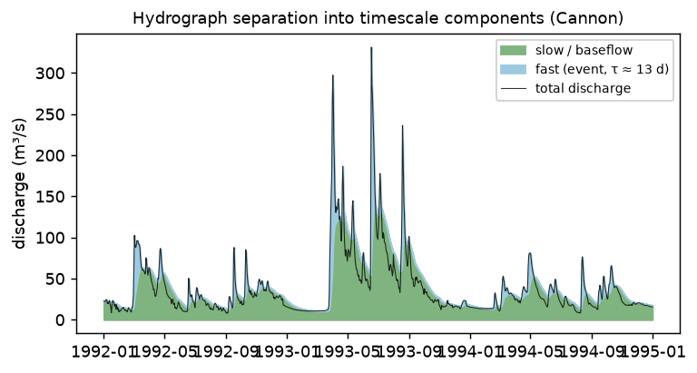

Data-Driven Priors
==================

:func:`~mnished.suggest_priors` combines
:class:`~mnished.BrutsaertNieber` recession analysis with
:class:`~mnished.HydrographSeparation` to produce a coherent set of
parameter starting points before any model run or calibration.

:class:`~mnished.HydrographSeparation` decomposes a discharge record into
reservoir-timescale components — a fast event response above a slow baseflow
store — which seed the reservoir recession timescales and initial storages:

   The Cannon discharge separated into a fast (event) component above a slow
   baseflow store; the fitted fast timescale (~13 days here) becomes a recession
   prior. Generated by ``docs/figures/plot_hydrograph_separation.py``.

See the :doc:`tutorial` for a full worked example.

.. autofunction:: mnished.suggest_priors

.. autoclass:: mnished.Priors
   :members: summary, to_yaml_snippet
   :member-order: bysource

Phenology leaf-out prior
------------------------

:func:`~mnished.leafout_GDD_from_date` derives the ``leafout_GDD`` phenology
prior (see :ref:`the phenology configuration section <vegetation-phenology>`)
from a *regional leaf-out date* — the quantity that spring-index phenology
climatologies provide (USA-NPN Extended Spring Indices; Schwartz et al. 2013,
:doc:`references`). It accumulates the basin's own forcing growing-degree-days to
that date, so the latitude dependence of green-up is carried by the date and the
basin's thermal climate rather than by a fitted latitude→GDD curve.

.. autofunction:: mnished.leafout_GDD_from_date
